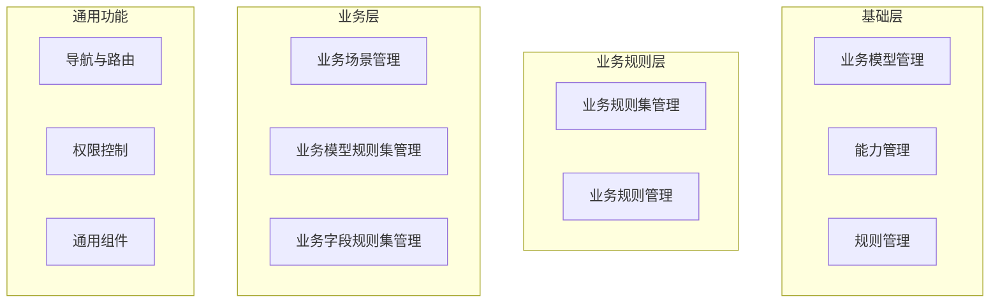

# 业务规则中心 - 前端测试用例列表

## 文档信息

| 项目 | 内容 |
|------|------|
| 项目名称 | 业务规则中心 |
| 文档版本 | v1.0 |
| 创建时间 | 2026-01-21 |
| 文档状态 | 待评审 |
| 依据文档 | 概要设计文档 v3.4 |

---

## 一、测试范围概述

### 1.1 测试模块



### 1.2 测试优先级说明

| 优先级 | 说明 | 标识 |
|--------|------|------|
| P0 | 核心功能，阻塞性测试 | 🔴 |
| P1 | 重要功能，主流程测试 | 🟠 |
| P2 | 一般功能，辅助流程测试 | 🟡 |
| P3 | 边缘场景，异常流程测试 | 🟢 |

---

## 二、基础层测试用例

### 2.1 业务模型管理（BizModel）

#### 2.1.1 列表页面

| 用例ID | 用例名称 | 优先级 | 前置条件 | 测试步骤 | 预期结果 |
|--------|----------|--------|----------|----------|----------|
| BM-L-001 | 业务模型列表加载 | 🔴 | 已登录系统 | 1. 进入业务模型管理页面 | 1. 页面正常加载<br>2. 显示模型列表（含名称、编码、版本、状态、字段数、更新时间） |
| BM-L-002 | 按名称搜索模型 | 🟠 | 存在多个业务模型 | 1. 输入模型名称关键字<br>2. 触发搜索 | 1. 列表过滤显示匹配结果<br>2. 高亮匹配关键字 |
| BM-L-003 | 按编码搜索模型 | 🟠 | 存在多个业务模型 | 1. 输入模型编码<br>2. 触发搜索 | 1. 精确匹配或模糊匹配显示结果 |
| BM-L-004 | 按状态筛选模型 | 🟡 | 存在不同状态的模型 | 1. 选择状态筛选条件（DRAFT/ACTIVE/INACTIVE） | 1. 列表仅显示对应状态的模型 |
| BM-L-005 | 列表分页功能 | 🟡 | 模型数量超过单页显示数 | 1. 查看分页控件<br>2. 切换页码 | 1. 正确显示总数<br>2. 切换页面数据正确加载 |
| BM-L-006 | 列表排序功能 | 🟢 | 存在多个业务模型 | 1. 点击列头进行排序 | 1. 按指定列升序/降序排列 |
| BM-L-007 | 空列表状态 | 🟢 | 无业务模型数据 | 1. 进入业务模型管理页面 | 1. 显示空状态提示<br>2. 显示创建引导 |

#### 2.1.2 创建功能

| 用例ID | 用例名称 | 优先级 | 前置条件 | 测试步骤 | 预期结果 |
|--------|----------|--------|----------|----------|----------|
| BM-C-001 | 创建业务模型-正常流程 | 🔴 | 已登录系统 | 1. 点击"新建模型"<br>2. 填写名称、编码、描述<br>3. 添加至少一个字段<br>4. 点击保存 | 1. 创建成功<br>2. 状态默认为DRAFT<br>3. 返回列表并显示新模型 |
| BM-C-002 | 创建模型-编码唯一性校验 | 🔴 | 已存在编码为"ORDER"的模型 | 1. 创建新模型<br>2. 输入已存在的编码"ORDER" | 1. 提示编码已存在<br>2. 不允许保存 |
| BM-C-003 | 创建模型-必填字段校验 | 🟠 | 已登录系统 | 1. 点击"新建模型"<br>2. 不填写名称直接保存 | 1. 提示名称为必填项<br>2. 表单校验不通过 |
| BM-C-004 | 创建模型-字段列表为空校验 | 🟠 | 已登录系统 | 1. 填写基本信息<br>2. 不添加任何字段<br>3. 点击保存 | 1. 提示"至少需要添加一个字段"<br>2. 不允许保存 |
| BM-C-005 | 创建模型-添加字段 | 🔴 | 打开创建模型表单 | 1. 点击"添加字段"<br>2. 填写字段名、类型、是否必填等 | 1. 字段成功添加到列表<br>2. 可以继续添加更多字段 |
| BM-C-006 | 创建模型-字段类型选择 | 🟠 | 打开创建模型表单 | 1. 添加字段<br>2. 选择不同字段类型 | 1. 支持所有类型：String, Integer, Long, Double, Boolean, Date, Object, Array |
| BM-C-007 | 创建模型-嵌套字段(Object) | 🟠 | 打开创建模型表单 | 1. 添加Object类型字段<br>2. 为Object添加子字段 | 1. 支持添加子字段<br>2. 树形展示嵌套结构 |
| BM-C-008 | 创建模型-数组字段(Array) | 🟠 | 打开创建模型表单 | 1. 添加Array类型字段<br>2. 定义数组元素结构 | 1. 支持定义数组元素类型<br>2. 支持Object数组配置 |
| BM-C-009 | 创建模型-字段枚举值配置 | 🟡 | 打开创建模型表单 | 1. 添加String类型字段<br>2. 配置枚举值列表 | 1. 可添加多个枚举值<br>2. 枚举值正确保存 |
| BM-C-010 | 创建模型-取消操作 | 🟢 | 填写了部分表单内容 | 1. 点击取消按钮 | 1. 提示确认取消<br>2. 确认后返回列表<br>3. 数据不保存 |

#### 2.1.3 编辑功能

| 用例ID | 用例名称 | 优先级 | 前置条件 | 测试步骤 | 预期结果 |
|--------|----------|--------|----------|----------|----------|
| BM-E-001 | 编辑DRAFT状态模型 | 🔴 | 存在DRAFT状态模型 | 1. 点击编辑按钮<br>2. 修改模型信息<br>3. 保存 | 1. 编辑成功<br>2. 修改内容正确保存 |
| BM-E-002 | 编辑ACTIVE状态模型-禁止 | 🔴 | 存在ACTIVE状态模型 | 1. 尝试编辑ACTIVE模型 | 1. 编辑按钮禁用或隐藏<br>2. 提示"已激活模型不可编辑" |
| BM-E-003 | 编辑模型-修改字段 | 🟠 | 存在DRAFT状态模型 | 1. 进入编辑页面<br>2. 修改已有字段属性 | 1. 字段属性修改成功 |
| BM-E-004 | 编辑模型-删除字段 | 🟠 | 模型有多个字段 | 1. 进入编辑页面<br>2. 删除某个字段 | 1. 字段成功删除<br>2. 如只剩一个字段，禁止删除 |
| BM-E-005 | 编辑模型-调整字段顺序 | 🟡 | 模型有多个字段 | 1. 拖拽字段调整顺序 | 1. 字段顺序成功调整 |

#### 2.1.4 详情查看

| 用例ID | 用例名称 | 优先级 | 前置条件 | 测试步骤 | 预期结果 |
|--------|----------|--------|----------|----------|----------|
| BM-D-001 | 查看模型详情 | 🔴 | 存在业务模型 | 1. 点击模型名称或详情按钮 | 1. 显示模型基本信息<br>2. 显示完整字段列表<br>3. 嵌套字段以树形展示 |
| BM-D-002 | 详情-字段树形展示 | 🟠 | 模型包含嵌套字段 | 1. 查看模型详情 | 1. Object/Array字段可展开<br>2. 显示完整嵌套结构 |
| BM-D-003 | 详情-复制编码 | 🟢 | 查看模型详情 | 1. 点击编码旁的复制按钮 | 1. 编码复制到剪贴板<br>2. 显示复制成功提示 |

#### 2.1.5 状态管理

| 用例ID | 用例名称 | 优先级 | 前置条件 | 测试步骤 | 预期结果 |
|--------|----------|--------|----------|----------|----------|
| BM-S-001 | 发布模型(DRAFT→ACTIVE) | 🔴 | 存在完整的DRAFT模型 | 1. 点击"发布"按钮<br>2. 确认发布 | 1. 状态变更为ACTIVE<br>2. 模型不可编辑 |
| BM-S-002 | 发布模型-字段不完整 | 🟠 | 模型字段信息不完整 | 1. 尝试发布模型 | 1. 提示必填信息未完成<br>2. 不允许发布 |
| BM-S-003 | 停用模型(ACTIVE→INACTIVE) | 🔴 | 存在ACTIVE状态模型 | 1. 点击"停用"按钮<br>2. 确认停用 | 1. 状态变更为INACTIVE<br>2. 提示可能影响的关联数据 |
| BM-S-004 | 重新激活模型(INACTIVE→ACTIVE) | 🟠 | 存在INACTIVE状态模型 | 1. 点击"激活"按钮 | 1. 状态变更为ACTIVE |
| BM-S-005 | 停用模型-级联警告 | 🟠 | 模型被业务场景引用 | 1. 尝试停用模型 | 1. 显示警告信息<br>2. 列出受影响的业务场景 |

---

### 2.2 能力管理（Capability）

#### 2.2.1 列表页面

| 用例ID | 用例名称 | 优先级 | 前置条件 | 测试步骤 | 预期结果 |
|--------|----------|--------|----------|----------|----------|
| CAP-L-001 | 能力列表加载 | 🔴 | 已登录系统 | 1. 进入能力管理页面 | 1. 显示能力列表（名称、编码、类型、版本、状态） |
| CAP-L-002 | 按能力类型筛选 | 🟠 | 存在不同类型能力 | 1. 选择类型筛选（RPC/FUNCTION/SCRIPT） | 1. 列表显示对应类型的能力 |
| CAP-L-003 | 搜索能力 | 🟠 | 存在多个能力 | 1. 输入能力名称或编码搜索 | 1. 显示匹配的能力列表 |

#### 2.2.2 创建功能

| 用例ID | 用例名称 | 优先级 | 前置条件 | 测试步骤 | 预期结果 |
|--------|----------|--------|----------|----------|----------|
| CAP-C-001 | 创建RPC类型能力 | 🔴 | 已登录系统 | 1. 点击新建能力<br>2. 选择类型为RPC<br>3. 填写基本信息和入出参定义<br>4. 保存 | 1. 能力创建成功<br>2. 入出参定义正确保存 |
| CAP-C-002 | 创建FUNCTION类型能力 | 🔴 | 已登录系统 | 1. 选择类型为FUNCTION<br>2. 填写信息 | 1. 创建成功 |
| CAP-C-003 | 创建SCRIPT类型能力 | 🔴 | 已登录系统 | 1. 选择类型为SCRIPT<br>2. 填写信息 | 1. 创建成功 |
| CAP-C-004 | 编码唯一性校验 | 🟠 | 已存在相同编码能力 | 1. 输入已存在的编码 | 1. 提示编码已存在 |
| CAP-C-005 | 入参定义配置 | 🟠 | 打开创建表单 | 1. 配置入参字段列表 | 1. 支持添加多个入参字段<br>2. 支持配置字段类型和必填属性 |
| CAP-C-006 | 出参定义配置 | 🟠 | 打开创建表单 | 1. 配置出参字段列表 | 1. 支持添加多个出参字段 |

#### 2.2.3 状态管理

| 用例ID | 用例名称 | 优先级 | 前置条件 | 测试步骤 | 预期结果 |
|--------|----------|--------|----------|----------|----------|
| CAP-S-001 | 发布能力 | 🔴 | 存在DRAFT能力 | 1. 点击发布 | 1. 状态变更为ACTIVE |
| CAP-S-002 | 停用能力-级联警告 | 🟠 | 能力被Rule引用 | 1. 停用能力 | 1. 警告关联的Rule将无法执行 |

---

### 2.3 规则管理（Rule）

#### 2.3.1 列表页面

| 用例ID | 用例名称 | 优先级 | 前置条件 | 测试步骤 | 预期结果 |
|--------|----------|--------|----------|----------|----------|
| RULE-L-001 | 规则列表加载 | 🔴 | 已登录系统 | 1. 进入规则管理页面 | 1. 显示规则列表（名称、编码、执行类型、版本、状态） |
| RULE-L-002 | 按执行类型筛选 | 🟠 | 存在不同类型规则 | 1. 选择执行类型（SIMPLE/CAPABILITY） | 1. 显示对应类型规则 |
| RULE-L-003 | 搜索规则 | 🟠 | 存在多个规则 | 1. 输入规则名称或编码 | 1. 显示匹配结果 |

#### 2.3.2 创建功能

| 用例ID | 用例名称 | 优先级 | 前置条件 | 测试步骤 | 预期结果 |
|--------|----------|--------|----------|----------|----------|
| RULE-C-001 | 创建SIMPLE类型规则 | 🔴 | 已登录系统 | 1. 选择执行类型SIMPLE<br>2. 填写基本信息<br>3. 配置入出参<br>4. 填写QL表达式<br>5. 保存 | 1. 规则创建成功<br>2. expression字段正确保存<br>3. capabilityId为空 |
| RULE-C-002 | 创建CAPABILITY类型规则 | 🔴 | 存在ACTIVE能力 | 1. 选择执行类型CAPABILITY<br>2. 选择关联能力<br>3. 保存 | 1. 规则创建成功<br>2. capabilityId正确关联<br>3. expression为空 |
| RULE-C-003 | SIMPLE类型-表达式必填校验 | 🟠 | 选择SIMPLE类型 | 1. 不填写表达式<br>2. 保存 | 1. 提示表达式为必填 |
| RULE-C-004 | CAPABILITY类型-能力必选校验 | 🟠 | 选择CAPABILITY类型 | 1. 不选择能力<br>2. 保存 | 1. 提示必须选择能力 |
| RULE-C-005 | 表达式编辑器 | 🟠 | 创建SIMPLE规则 | 1. 打开表达式编辑器<br>2. 编写QL表达式 | 1. 支持语法高亮<br>2. 支持基本补全 |
| RULE-C-006 | 能力选择器 | 🟠 | 创建CAPABILITY规则 | 1. 打开能力选择器 | 1. 仅显示ACTIVE状态能力<br>2. 支持搜索能力 |
| RULE-C-007 | 互斥校验-同时填写表达式和能力 | 🟠 | 创建规则 | 1. 同时填写expression和选择capability | 1. 提示二者互斥<br>2. 不允许保存 |

#### 2.3.3 状态管理

| 用例ID | 用例名称 | 优先级 | 前置条件 | 测试步骤 | 预期结果 |
|--------|----------|--------|----------|----------|----------|
| RULE-S-001 | 发布规则 | 🔴 | 存在完整DRAFT规则 | 1. 点击发布 | 1. 状态变更为ACTIVE |
| RULE-S-002 | CAPABILITY规则发布-能力状态校验 | 🟠 | 规则关联的能力为INACTIVE | 1. 尝试发布规则 | 1. 提示关联能力未激活<br>2. 不允许发布 |
| RULE-S-003 | 停用规则-级联警告 | 🟠 | 规则被BizRule引用 | 1. 停用规则 | 1. 警告关联的BizRule将受影响 |

---

## 三、业务规则层测试用例

### 3.1 业务规则集管理（BizRuleSet）

#### 3.1.1 列表页面

| 用例ID | 用例名称 | 优先级 | 前置条件 | 测试步骤 | 预期结果 |
|--------|----------|--------|----------|----------|----------|
| BRS-L-001 | 业务规则集列表加载 | 🔴 | 已登录系统 | 1. 进入业务规则集管理页面 | 1. 显示列表（名称、编码、关联模型、执行策略、聚合策略、状态） |
| BRS-L-002 | 按业务模型筛选 | 🟠 | 存在多个业务模型 | 1. 选择业务模型筛选 | 1. 显示该模型下的规则集 |
| BRS-L-003 | 按执行策略筛选 | 🟡 | 存在不同策略规则集 | 1. 选择执行策略（SERIAL/PARALLEL/FAIL_FAST） | 1. 显示对应策略的规则集 |

#### 3.1.2 创建功能

| 用例ID | 用例名称 | 优先级 | 前置条件 | 测试步骤 | 预期结果 |
|--------|----------|--------|----------|----------|----------|
| BRS-C-001 | 创建业务规则集 | 🔴 | 存在ACTIVE业务模型 | 1. 点击新建<br>2. 选择业务模型<br>3. 填写名称、编码<br>4. 选择执行策略和聚合策略<br>5. 保存 | 1. 创建成功<br>2. bizModelId正确关联 |
| BRS-C-002 | 执行策略选择-SERIAL | 🟠 | 创建规则集 | 1. 选择SERIAL策略 | 1. 策略正确保存<br>2. 说明文案显示"串行执行，按顺序" |
| BRS-C-003 | 执行策略选择-PARALLEL | 🟠 | 创建规则集 | 1. 选择PARALLEL策略 | 1. 策略正确保存<br>2. 说明文案显示"并行执行" |
| BRS-C-004 | 执行策略选择-FAIL_FAST | 🟠 | 创建规则集 | 1. 选择FAIL_FAST策略 | 1. 策略正确保存<br>2. 说明文案显示"串行执行，遇错即停" |
| BRS-C-005 | 聚合策略选择-MERGE | 🟠 | 创建规则集 | 1. 选择MERGE策略 | 1. 策略正确保存 |
| BRS-C-006 | 聚合策略选择-LAST | 🟠 | 创建规则集 | 1. 选择LAST策略 | 1. 策略正确保存 |
| BRS-C-007 | 聚合策略选择-FIRST_SUCCESS | 🟠 | 创建规则集 | 1. 选择FIRST_SUCCESS策略 | 1. 策略正确保存 |
| BRS-C-008 | 编码唯一性校验 | 🟠 | 已存在相同编码 | 1. 输入已存在编码 | 1. 提示编码已存在 |

#### 3.1.3 详情与规则管理

| 用例ID | 用例名称 | 优先级 | 前置条件 | 测试步骤 | 预期结果 |
|--------|----------|--------|----------|----------|----------|
| BRS-D-001 | 查看规则集详情 | 🔴 | 存在业务规则集 | 1. 点击规则集名称 | 1. 显示基本信息<br>2. 显示包含的BizRule列表 |
| BRS-D-002 | 添加业务规则到规则集 | 🔴 | 规则集为DRAFT状态 | 1. 点击"添加规则"<br>2. 选择Rule模板<br>3. 配置BizRule参数<br>4. 保存 | 1. BizRule创建成功<br>2. BizRule.bizRuleSetId正确设置<br>3. BizRule.bizModelId自动继承 |
| BRS-D-003 | BizRule优先级设置 | 🟠 | 规则集包含多个规则 | 1. 设置各规则优先级 | 1. 优先级正确保存<br>2. 列表按优先级排序显示 |
| BRS-D-004 | BizRule优先级-拖拽调整 | 🟡 | 规则集包含多个规则 | 1. 拖拽规则调整顺序 | 1. 优先级自动更新 |
| BRS-D-005 | 规则集内规则名称唯一校验 | 🟠 | 规则集已有规则A | 1. 添加新规则<br>2. 输入相同名称 | 1. 提示名称已存在 |

---

### 3.2 业务规则管理（BizRule）

#### 3.2.1 创建功能

| 用例ID | 用例名称 | 优先级 | 前置条件 | 测试步骤 | 预期结果 |
|--------|----------|--------|----------|----------|----------|
| BR-C-001 | 创建VALIDATION类型规则 | 🔴 | 存在Rule模板和BizRuleSet | 1. 选择Rule模板<br>2. 设置ruleType为VALIDATION<br>3. 配置inputMapping<br>4. 保存 | 1. 创建成功<br>2. ruleType正确保存 |
| BR-C-002 | 创建OPTIMIZATION类型规则 | 🔴 | 存在Rule模板和BizRuleSet | 1. 设置ruleType为OPTIMIZATION<br>2. 配置相关映射<br>3. 保存 | 1. 创建成功 |
| BR-C-003 | 配置inputMapping | 🔴 | 创建BizRule | 1. 配置业务模型字段到Rule入参的映射 | 1. 映射配置正确保存<br>2. 支持bizModel.字段路径<br>3. 支持config.字段路径 |
| BR-C-004 | 配置outputMapping | 🟠 | 创建BizRule | 1. 配置规则输出到返回结果的映射 | 1. 映射配置正确保存 |
| BR-C-005 | 配置bizModelMapping | 🟠 | 创建BizRule | 1. 配置规则输出回写到业务模型 | 1. 映射配置正确保存 |
| BR-C-006 | 配置precondition | 🟠 | 创建BizRule | 1. 填写前置条件表达式 | 1. 表达式正确保存<br>2. 支持QL语法 |
| BR-C-007 | 配置configModel | 🟠 | 创建BizRule | 1. 定义配置模型结构 | 1. 配置模型正确保存 |
| BR-C-008 | 配置configValue | 🟠 | 已定义configModel | 1. 根据configModel填写配置值 | 1. 配置值正确保存<br>2. 校验与configModel匹配 |
| BR-C-009 | inputMapping字段校验 | 🟠 | 配置inputMapping | 1. 引用不存在的业务模型字段 | 1. 提示字段不存在<br>2. 不允许保存 |

#### 3.2.2 映射配置器

| 用例ID | 用例名称 | 优先级 | 前置条件 | 测试步骤 | 预期结果 |
|--------|----------|--------|----------|----------|----------|
| BR-M-001 | 映射配置-可视化编辑器 | 🟠 | 配置inputMapping | 1. 打开映射配置器 | 1. 左侧显示源字段列表（bizModel + config）<br>2. 右侧显示目标字段列表（ruleInput）<br>3. 支持拖拽连线 |
| BR-M-002 | 映射配置-嵌套字段选择 | 🟠 | 业务模型含嵌套字段 | 1. 展开嵌套结构<br>2. 选择子字段映射 | 1. 支持点号路径（如bizModel.address.city） |
| BR-M-003 | 映射配置-数组字段 | 🟠 | 业务模型含数组字段 | 1. 选择数组元素字段 | 1. 支持[*]通配符路径 |
| BR-M-004 | 映射配置-转换表达式 | 🟡 | 配置映射 | 1. 为映射添加transform表达式 | 1. 表达式正确保存 |
| BR-M-005 | 映射配置-默认值 | 🟡 | 配置映射 | 1. 设置字段默认值 | 1. 默认值正确保存 |

---

## 四、业务层测试用例

### 4.1 业务场景管理（BizScenario）

#### 4.1.1 列表页面

| 用例ID | 用例名称 | 优先级 | 前置条件 | 测试步骤 | 预期结果 |
|--------|----------|--------|----------|----------|----------|
| BS-L-001 | 业务场景列表加载 | 🔴 | 已登录系统 | 1. 进入业务场景管理页面 | 1. 显示场景列表（名称、编码、关联模型、身份字段数、规则集数、状态） |
| BS-L-002 | 按业务模型筛选 | 🟠 | 存在多个业务模型 | 1. 选择业务模型 | 1. 显示关联该模型的场景 |
| BS-L-003 | 搜索业务场景 | 🟠 | 存在多个场景 | 1. 输入场景名称或编码 | 1. 显示匹配结果 |

#### 4.1.2 创建功能

| 用例ID | 用例名称 | 优先级 | 前置条件 | 测试步骤 | 预期结果 |
|--------|----------|--------|----------|----------|----------|
| BS-C-001 | 创建业务场景 | 🔴 | 存在ACTIVE业务模型 | 1. 点击新建<br>2. 填写名称、编码<br>3. 选择业务模型<br>4. 保存 | 1. 创建成功 |
| BS-C-002 | 配置业务身份字段 | 🔴 | 创建业务场景 | 1. 点击"添加身份字段"<br>2. 从业务模型字段中选择<br>3. 设置字段code和映射 | 1. 身份字段添加成功<br>2. index自动分配（1-10） |
| BS-C-003 | 身份字段数量限制 | 🟠 | 已添加10个身份字段 | 1. 尝试添加第11个身份字段 | 1. 提示最多支持10个身份字段<br>2. 不允许添加 |
| BS-C-004 | 配置子场景 | 🟠 | 创建业务场景 | 1. 点击"添加子场景"<br>2. 填写子场景code、名称、描述 | 1. 子场景添加成功 |
| BS-C-005 | 子场景code唯一性 | 🟡 | 已存在子场景A | 1. 添加相同code的子场景 | 1. 提示code已存在 |
| BS-C-006 | 身份字段映射校验 | 🟠 | 配置身份字段 | 1. 选择modelFieldMapping | 1. 下拉仅显示业务模型的字段<br>2. 映射正确保存 |

#### 4.1.3 详情与管理

| 用例ID | 用例名称 | 优先级 | 前置条件 | 测试步骤 | 预期结果 |
|--------|----------|--------|----------|----------|----------|
| BS-D-001 | 查看场景详情 | 🔴 | 存在业务场景 | 1. 点击场景名称 | 1. 显示基本信息<br>2. 显示身份字段列表<br>3. 显示子场景列表<br>4. 显示关联的BizModelRuleSet |
| BS-D-002 | 删除身份字段 | 🟠 | 场景有身份字段 | 1. 点击删除身份字段 | 1. 确认后删除成功<br>2. 提示可能影响的规则集 |
| BS-D-003 | 删除子场景 | 🟠 | 场景有子场景 | 1. 点击删除子场景 | 1. 确认后删除成功 |

#### 4.1.4 状态管理

| 用例ID | 用例名称 | 优先级 | 前置条件 | 测试步骤 | 预期结果 |
|--------|----------|--------|----------|----------|----------|
| BS-S-001 | 发布业务场景 | 🔴 | 存在完整DRAFT场景 | 1. 点击发布 | 1. 状态变更为ACTIVE |
| BS-S-002 | 发布场景-关联模型状态校验 | 🟠 | 关联的业务模型为INACTIVE | 1. 尝试发布场景 | 1. 提示关联模型未激活<br>2. 不允许发布 |
| BS-S-003 | 停用场景-级联停用 | 🔴 | 场景下有BizModelRuleSet | 1. 停用场景 | 1. 场景状态变更<br>2. 所属BizModelRuleSet级联停用 |

---

### 4.2 业务模型规则集管理（BizModelRuleSet）

#### 4.2.1 列表页面

| 用例ID | 用例名称 | 优先级 | 前置条件 | 测试步骤 | 预期结果 |
|--------|----------|--------|----------|----------|----------|
| BMRS-L-001 | 业务模型规则集列表 | 🔴 | 已登录系统 | 1. 进入业务模型规则集页面 | 1. 显示列表（名称、编码、业务场景、业务身份值、状态） |
| BMRS-L-002 | 按业务场景筛选 | 🟠 | 存在多个业务场景 | 1. 选择业务场景 | 1. 显示该场景下的规则集 |
| BMRS-L-003 | 按业务身份筛选 | 🟠 | 存在不同身份值的规则集 | 1. 选择身份字段值筛选 | 1. 显示匹配的规则集 |

#### 4.2.2 创建功能

| 用例ID | 用例名称 | 优先级 | 前置条件 | 测试步骤 | 预期结果 |
|--------|----------|--------|----------|----------|----------|
| BMRS-C-001 | 创建业务模型规则集 | 🔴 | 存在ACTIVE业务场景 | 1. 点击新建<br>2. 选择业务场景<br>3. 填写业务身份值<br>4. 保存 | 1. 创建成功<br>2. bizModelId自动从场景继承 |
| BMRS-C-002 | 填写业务身份值-精确值 | 🔴 | 创建规则集 | 1. 为身份字段填写具体值 | 1. 值正确保存到identityField1~10 |
| BMRS-C-003 | 填写业务身份值-通配符 | 🔴 | 创建规则集 | 1. 为身份字段填写"*" | 1. 通配符正确保存 |
| BMRS-C-004 | 业务身份唯一约束校验 | 🟠 | 已存在相同身份组合的规则集 | 1. 创建相同身份组合的规则集 | 1. 提示身份组合已存在<br>2. 不允许创建 |
| BMRS-C-005 | 选择子场景 | 🟠 | 业务场景有子场景 | 1. 选择关联的子场景 | 1. subScenarioCode正确保存 |
| BMRS-C-006 | 配置继承关系 | 🟠 | 存在其他ACTIVE规则集 | 1. 选择要继承的规则集 | 1. inheritedBizModelRuleSetIds正确保存<br>2. 支持多选（多继承） |
| BMRS-C-007 | 继承-同场景约束校验 | 🟠 | 选择不同场景的规则集继承 | 1. 选择其他场景的规则集 | 1. 提示只能继承同场景规则集<br>2. 不允许选择 |
| BMRS-C-008 | 继承-循环继承检测 | 🟠 | A继承B，尝试B继承A | 1. 配置循环继承关系 | 1. 检测到循环<br>2. 提示不允许循环继承 |
| BMRS-C-009 | 继承-深度限制校验 | 🟠 | 继承链已达5层 | 1. 尝试添加第6层继承 | 1. 提示超过最大继承深度<br>2. 不允许保存 |
| BMRS-C-010 | 继承-业务身份兼容性校验 | 🟠 | 父规则集region=B，子规则集region=A | 1. 配置不兼容的继承 | 1. 提示业务身份不兼容<br>2. 不允许继承 |
| BMRS-C-011 | 继承-顺序设置 | 🟡 | 配置多继承 | 1. 调整继承规则集顺序 | 1. 靠前的优先级更高<br>2. 顺序正确保存 |

#### 4.2.3 详情页面-字段树形展示

| 用例ID | 用例名称 | 优先级 | 前置条件 | 测试步骤 | 预期结果 |
|--------|----------|--------|----------|----------|----------|
| BMRS-D-001 | 查看规则集详情-字段列表 | 🔴 | 存在业务模型规则集 | 1. 点击规则集名称 | 1. 显示业务身份信息<br>2. 以树形展示业务模型字段<br>3. 显示每个字段的规则配置状态 |
| BMRS-D-002 | 字段树-折叠展开 | 🟠 | 模型含嵌套字段 | 1. 点击Object/Array字段的展开按钮 | 1. 展开显示子字段<br>2. 再次点击折叠 |
| BMRS-D-003 | 字段树-全部展开 | 🟡 | 模型含多级嵌套 | 1. 点击"全部展开" | 1. 所有层级展开 |
| BMRS-D-004 | 字段树-全部折叠 | 🟡 | 字段已展开 | 1. 点击"全部折叠" | 1. 所有层级折叠 |
| BMRS-D-005 | 字段搜索 | 🟠 | 模型含多个字段 | 1. 输入字段名搜索 | 1. 过滤显示匹配字段<br>2. 高亮匹配关键字 |
| BMRS-D-006 | 筛选-只看已配置 | 🟠 | 部分字段已配置规则 | 1. 勾选"只看已配置" | 1. 仅显示已配置规则的字段 |
| BMRS-D-007 | 筛选-按字段类型 | 🟡 | 存在不同类型字段 | 1. 选择字段类型筛选 | 1. 显示对应类型字段 |
| BMRS-D-008 | 字段配置状态显示 | 🔴 | 部分字段已配置 | 1. 查看字段列表 | 1. 已配置显示✅和规则数量<br>2. 未配置显示[ - ] |
| BMRS-D-009 | 已配置字段统计 | 🟡 | 查看详情页 | 1. 查看统计信息 | 1. 显示"已配置: X/Y"格式 |

#### 4.2.4 字段规则配置入口

| 用例ID | 用例名称 | 优先级 | 前置条件 | 测试步骤 | 预期结果 |
|--------|----------|--------|----------|----------|----------|
| BMRS-F-001 | 为字段添加规则-入口 | 🔴 | 查看规则集详情 | 1. 点击字段的"添加规则"或[ - ] | 1. 打开字段规则集编辑面板 |
| BMRS-F-002 | 编辑已配置字段规则 | 🔴 | 字段已配置规则 | 1. 点击字段的"编辑" | 1. 打开字段规则集编辑面板<br>2. 显示已有规则 |
| BMRS-F-003 | 复制字段路径 | 🟢 | 查看字段列表 | 1. 右键字段<br>2. 选择"复制字段路径" | 1. 路径复制到剪贴板<br>2. 格式如：bizModel.address.city |

---

### 4.3 业务字段规则集管理（BizFieldRuleSet）

#### 4.3.1 创建与配置

| 用例ID | 用例名称 | 优先级 | 前置条件 | 测试步骤 | 预期结果 |
|--------|----------|--------|----------|----------|----------|
| BFRS-C-001 | 创建字段规则集 | 🔴 | 从BizModelRuleSet详情进入 | 1. 点击字段"添加规则"<br>2. 系统自动创建BizFieldRuleSet和关联的BizRuleSet<br>3. 添加BizRule | 1. BizFieldRuleSet创建成功<br>2. BizRuleSet自动创建并关联<br>3. businessField正确设置 |
| BFRS-C-002 | 配置关联字段 | 🟠 | 创建字段规则集 | 1. 添加relatedFields | 1. 可选择业务模型中的其他字段<br>2. relatedFields正确保存 |
| BFRS-C-003 | businessField唯一性校验 | 🟠 | 同一BizModelRuleSet | 1. 为已配置字段再次添加规则集 | 1. 提示该字段已配置<br>2. 跳转到已有配置 |
| BFRS-C-004 | bizModelId一致性校验 | 🔴 | 创建字段规则集 | 1. 系统自动校验 | 1. BizFieldRuleSet.bizModelId与BizModelRuleSet一致<br>2. BizRuleSet.bizModelId一致<br>3. 所有BizRule.bizModelId一致 |

#### 4.3.2 规则编辑面板

| 用例ID | 用例名称 | 优先级 | 前置条件 | 测试步骤 | 预期结果 |
|--------|----------|--------|----------|----------|----------|
| BFRS-E-001 | 字段规则集编辑面板 | 🔴 | 打开字段规则配置 | 1. 查看编辑面板 | 1. 显示字段名称和类型<br>2. 显示已配置规则列表<br>3. 显示"添加规则"按钮 |
| BFRS-E-002 | 添加规则到字段 | 🔴 | 打开编辑面板 | 1. 点击"添加规则"<br>2. 选择Rule模板<br>3. 配置BizRule参数<br>4. 保存 | 1. BizRule创建成功<br>2. 关联到字段的BizRuleSet |
| BFRS-E-003 | 规则列表显示 | 🟠 | 字段已配置多个规则 | 1. 查看规则列表 | 1. 显示规则名称<br>2. 显示规则类型（VALIDATION/OPTIMIZATION）<br>3. 显示优先级 |
| BFRS-E-004 | 删除字段规则 | 🟠 | 字段有多个规则 | 1. 点击规则的删除按钮<br>2. 确认删除 | 1. 规则删除成功<br>2. 列表更新 |
| BFRS-E-005 | 调整规则优先级 | 🟠 | 字段有多个规则 | 1. 拖拽规则调整顺序 | 1. 优先级更新 |

#### 4.3.3 数组字段规则配置

| 用例ID | 用例名称 | 优先级 | 前置条件 | 测试步骤 | 预期结果 |
|--------|----------|--------|----------|----------|----------|
| BFRS-A-001 | 数组字段-分区显示 | 🟠 | 配置Array类型字段规则 | 1. 打开数组字段配置面板 | 1. 分"数组级规则"和"元素级规则"两区域显示 |
| BFRS-A-002 | 添加数组级规则 | 🟠 | 打开数组字段配置 | 1. 在数组级区域添加规则 | 1. 规则作用于整个数组<br>2. 可配置如数组长度校验 |
| BFRS-A-003 | 添加元素级规则 | 🟠 | 打开数组字段配置 | 1. 选择数组元素字段<br>2. 添加规则 | 1. 规则作用于每个元素<br>2. businessField格式如：items[*].price |
| BFRS-A-004 | 元素字段树形展示 | 🟠 | Array元素为Object | 1. 展开数组元素结构 | 1. 以树形显示元素字段<br>2. 可为每个元素字段配置规则 |

---

## 五、通用功能测试用例

### 5.1 导航与路由

| 用例ID | 用例名称 | 优先级 | 前置条件 | 测试步骤 | 预期结果 |
|--------|----------|--------|----------|----------|----------|
| NAV-001 | 侧边栏导航-基础层 | 🔴 | 已登录系统 | 1. 展开基础层菜单<br>2. 点击各子菜单 | 1. 正确跳转到对应页面<br>2. 菜单高亮当前位置 |
| NAV-002 | 侧边栏导航-业务规则层 | 🔴 | 已登录系统 | 1. 展开业务规则层菜单<br>2. 点击各子菜单 | 1. 正确跳转到对应页面 |
| NAV-003 | 侧边栏导航-业务层 | 🔴 | 已登录系统 | 1. 展开业务层菜单<br>2. 点击各子菜单 | 1. 正确跳转到对应页面 |
| NAV-004 | 菜单折叠展开 | 🟠 | 已登录系统 | 1. 点击菜单组标题 | 1. 菜单组展开/折叠<br>2. 保持其他组状态 |
| NAV-005 | 面包屑导航 | 🟠 | 进入详情页 | 1. 查看面包屑<br>2. 点击面包屑项 | 1. 显示完整路径<br>2. 可点击返回上级 |
| NAV-006 | 浏览器前进后退 | 🟡 | 在多个页面间切换过 | 1. 点击浏览器后退<br>2. 点击浏览器前进 | 1. 页面正确切换<br>2. 状态正确恢复 |
| NAV-007 | URL直接访问 | 🟡 | 已知页面URL | 1. 直接在地址栏输入URL | 1. 正确加载对应页面 |

### 5.2 表单通用功能

| 用例ID | 用例名称 | 优先级 | 前置条件 | 测试步骤 | 预期结果 |
|--------|----------|--------|----------|----------|----------|
| FORM-001 | 必填字段标识 | 🟠 | 打开任意创建表单 | 1. 查看表单字段 | 1. 必填字段有红色*标识 |
| FORM-002 | 必填字段校验 | 🔴 | 打开创建表单 | 1. 不填写必填字段<br>2. 点击保存 | 1. 显示校验错误<br>2. 高亮错误字段<br>3. 不提交表单 |
| FORM-003 | 输入长度限制 | 🟡 | 打开创建表单 | 1. 输入超长内容 | 1. 限制输入或提示超长 |
| FORM-004 | 特殊字符校验 | 🟡 | 编码类输入框 | 1. 输入特殊字符 | 1. 提示格式错误或自动过滤 |
| FORM-005 | 表单重复提交防护 | 🟠 | 填写完表单 | 1. 快速多次点击保存 | 1. 仅提交一次<br>2. 按钮禁用或加载状态 |
| FORM-006 | 表单取消确认 | 🟡 | 修改了表单内容 | 1. 点击取消 | 1. 弹出确认对话框<br>2. 确认后放弃修改 |

### 5.3 列表通用功能

| 用例ID | 用例名称 | 优先级 | 前置条件 | 测试步骤 | 预期结果 |
|--------|----------|--------|----------|----------|----------|
| LIST-001 | 列表加载状态 | 🟠 | 进入列表页 | 1. 观察加载过程 | 1. 显示加载指示器<br>2. 加载完成后显示数据 |
| LIST-002 | 列表为空状态 | 🟠 | 无数据 | 1. 查看空列表 | 1. 显示空状态插图<br>2. 显示引导文案 |
| LIST-003 | 列表加载失败 | 🟠 | 网络异常 | 1. 断网后刷新列表 | 1. 显示错误提示<br>2. 提供重试按钮 |
| LIST-004 | 搜索防抖 | 🟡 | 打开列表页 | 1. 快速输入搜索关键字 | 1. 不会频繁触发请求<br>2. 输入停止后执行搜索 |
| LIST-005 | 搜索清空 | 🟡 | 已输入搜索条件 | 1. 点击清空按钮 | 1. 清空搜索框<br>2. 恢复完整列表 |
| LIST-006 | 多条件筛选组合 | 🟠 | 存在多个筛选条件 | 1. 选择多个筛选条件 | 1. 筛选条件AND组合<br>2. 显示符合所有条件的数据 |

### 5.4 状态徽标显示

| 用例ID | 用例名称 | 优先级 | 前置条件 | 测试步骤 | 预期结果 |
|--------|----------|--------|----------|----------|----------|
| BADGE-001 | DRAFT状态显示 | 🟠 | 存在DRAFT状态数据 | 1. 查看状态徽标 | 1. 显示"草稿"文案<br>2. 使用草稿主题色 |
| BADGE-002 | ACTIVE状态显示 | 🟠 | 存在ACTIVE状态数据 | 1. 查看状态徽标 | 1. 显示"已激活"文案<br>2. 使用成功主题色 |
| BADGE-003 | INACTIVE状态显示 | 🟠 | 存在INACTIVE状态数据 | 1. 查看状态徽标 | 1. 显示"已停用"文案<br>2. 使用禁用主题色 |

### 5.5 操作确认与提示

| 用例ID | 用例名称 | 优先级 | 前置条件 | 测试步骤 | 预期结果 |
|--------|----------|--------|----------|----------|----------|
| CONFIRM-001 | 状态变更确认 | 🔴 | 点击状态变更按钮 | 1. 点击发布/停用/激活 | 1. 弹出确认对话框<br>2. 显示操作影响说明 |
| CONFIRM-002 | 级联影响提示 | 🔴 | 停用被引用的数据 | 1. 停用被引用的模型/规则 | 1. 显示受影响的关联数据<br>2. 用户确认后执行 |
| TOAST-001 | 操作成功提示 | 🟠 | 执行创建/编辑/状态变更 | 1. 操作成功后 | 1. 显示成功Toast<br>2. 自动消失 |
| TOAST-002 | 操作失败提示 | 🟠 | 操作失败 | 1. 操作失败后 | 1. 显示错误Toast<br>2. 显示错误原因 |

---

## 六、继承与匹配规则测试

### 6.1 继承执行测试

| 用例ID | 用例名称 | 优先级 | 前置条件 | 测试步骤 | 预期结果 |
|--------|----------|--------|----------|----------|----------|
| INH-001 | 继承关系可视化 | 🟠 | 规则集配置了继承 | 1. 查看规则集详情 | 1. 显示继承关系图<br>2. 显示继承层级 |
| INH-002 | 继承规则合并预览 | 🟡 | 规则集有多层继承 | 1. 查看合并后的规则列表 | 1. 显示所有生效规则<br>2. 标注规则来源（本级/继承） |
| INH-003 | 继承优先级展示 | 🟡 | 配置多继承 | 1. 查看继承列表 | 1. 显示继承顺序<br>2. 说明优先级规则 |
| INH-004 | 继承深度显示 | 🟡 | 存在多层继承 | 1. 查看继承信息 | 1. 显示当前继承深度<br>2. 接近限制时警告 |

### 6.2 规则集匹配测试

| 用例ID | 用例名称 | 优先级 | 前置条件 | 测试步骤 | 预期结果 |
|--------|----------|--------|----------|----------|----------|
| MATCH-001 | 匹配预览功能 | 🟠 | 存在多个规则集 | 1. 输入业务身份值<br>2. 点击"匹配预览" | 1. 显示匹配到的规则集列表<br>2. 按优先级排序 |
| MATCH-002 | 精确匹配优先展示 | 🟠 | 存在精确和通配符规则集 | 1. 执行匹配预览 | 1. 精确匹配的规则集排在前面 |
| MATCH-003 | 匹配结果解释 | 🟡 | 执行匹配预览 | 1. 查看匹配结果 | 1. 说明匹配原因<br>2. 标注哪些字段精确匹配/通配符匹配 |

---

## 七、响应式与兼容性测试

### 7.1 响应式布局

| 用例ID | 用例名称 | 优先级 | 前置条件 | 测试步骤 | 预期结果 |
|--------|----------|--------|----------|----------|----------|
| RES-001 | 大屏幕显示(>1920px) | 🟡 | 大屏幕设备 | 1. 在大屏幕查看系统 | 1. 布局合理<br>2. 无过度拉伸 |
| RES-002 | 标准屏幕(1366-1920px) | 🔴 | 标准屏幕设备 | 1. 在标准屏幕查看 | 1. 布局正常<br>2. 功能完整 |
| RES-003 | 小屏幕(1024-1366px) | 🟠 | 小屏幕设备 | 1. 在小屏幕查看 | 1. 内容不溢出<br>2. 可滚动查看 |
| RES-004 | 侧边栏收起 | 🟡 | 小屏幕设备 | 1. 查看侧边栏 | 1. 侧边栏可收起<br>2. 增加内容区域 |

### 7.2 浏览器兼容性

| 用例ID | 用例名称 | 优先级 | 前置条件 | 测试步骤 | 预期结果 |
|--------|----------|--------|----------|----------|----------|
| BROWSER-001 | Chrome浏览器 | 🔴 | Chrome最新版 | 1. 在Chrome中测试主要功能 | 1. 所有功能正常 |
| BROWSER-002 | Edge浏览器 | 🟠 | Edge最新版 | 1. 在Edge中测试主要功能 | 1. 所有功能正常 |
| BROWSER-003 | Firefox浏览器 | 🟡 | Firefox最新版 | 1. 在Firefox中测试主要功能 | 1. 主要功能正常 |
| BROWSER-004 | Safari浏览器 | 🟡 | Safari最新版 | 1. 在Safari中测试主要功能 | 1. 主要功能正常 |

---

## 八、性能测试要点

### 8.1 页面加载性能

| 用例ID | 用例名称 | 优先级 | 测试要点 | 预期指标 |
|--------|----------|--------|----------|----------|
| PERF-001 | 首页加载时间 | 🟠 | 首次加载时间 | < 3秒 |
| PERF-002 | 列表页加载 | 🟠 | 列表数据加载时间 | < 2秒（100条数据） |
| PERF-003 | 大字段模型加载 | 🟠 | 100+字段的模型详情 | < 3秒 |
| PERF-004 | 字段树渲染性能 | 🟠 | 大字段列表渲染 | 无明显卡顿 |
| PERF-005 | 搜索响应时间 | 🟡 | 搜索结果返回时间 | < 1秒 |

### 8.2 操作响应性能

| 用例ID | 用例名称 | 优先级 | 测试要点 | 预期指标 |
|--------|----------|--------|----------|----------|
| PERF-006 | 表单提交响应 | 🟠 | 创建/编辑保存时间 | < 2秒 |
| PERF-007 | 状态变更响应 | 🟠 | 状态变更完成时间 | < 1秒 |
| PERF-008 | 树节点展开 | 🟡 | 展开子节点响应 | < 200ms |
| PERF-009 | 映射配置器渲染 | 🟡 | 打开映射配置器 | < 500ms |

---

## 附录A：测试数据准备

### A.1 业务模型测试数据

```yaml
# 基础订单模型
ORDER:
  fields:
    - orderId: Long, required
    - amount: Double, required
    - status: String, required, enum: [CREATED, PAID, SHIPPED, COMPLETED]
    - region: String, required
    - channel: String, required
    - address:
        type: Object
        children:
          - province: String
          - city: String
          - detail: String
    - items:
        type: Array
        elementType: Object
        children:
          - itemId: Long
          - name: String
          - price: Double
          - quantity: Integer

# 大字段模型（100+字段，用于性能测试）
LARGE_MODEL:
  fields: 120个字段，含多级嵌套
```

### A.2 业务身份测试数据

```yaml
# 测试场景：订单校验
IDENTITY_FIELDS:
  - region: [华东, 华北, 华南, 西部, *]
  - channel: [天猫, 淘宝, 京东, 线下, *]
  - bizType: [B2C, B2B, O2O, *]

# 优先级测试用例
RULE_SETS:
  - RS1: region=华东, channel=天猫, bizType=B2C  # 全精确
  - RS2: region=华东, channel=天猫, bizType=*     # 2精确1通配
  - RS3: region=华东, channel=*, bizType=B2C      # 2精确1通配
  - RS4: region=*, channel=天猫, bizType=B2C      # 2精确1通配
  - RS5: region=*, channel=*, bizType=*           # 全通配
```

---

## 附录B：测试用例统计

| 模块 | P0 | P1 | P2 | P3 | 总计 |
|------|-----|-----|-----|-----|------|
| 业务模型管理 | 8 | 10 | 5 | 3 | 26 |
| 能力管理 | 4 | 4 | 0 | 0 | 8 |
| 规则管理 | 5 | 8 | 0 | 0 | 13 |
| 业务规则集管理 | 4 | 9 | 0 | 1 | 14 |
| 业务规则管理 | 4 | 10 | 2 | 0 | 16 |
| 业务场景管理 | 5 | 7 | 2 | 0 | 14 |
| 业务模型规则集管理 | 6 | 18 | 6 | 1 | 31 |
| 业务字段规则集管理 | 5 | 8 | 0 | 0 | 13 |
| 导航与路由 | 3 | 2 | 2 | 0 | 7 |
| 通用功能 | 4 | 10 | 6 | 0 | 20 |
| 继承与匹配 | 0 | 3 | 4 | 0 | 7 |
| 响应式与兼容性 | 1 | 2 | 5 | 0 | 8 |
| 性能测试 | 0 | 6 | 3 | 0 | 9 |
| **总计** | **49** | **97** | **35** | **5** | **186** |

---

*文档结束*
