# 业务规则中心 - 概要设计文档

## 文档信息

| 项目 | 内容 |
|------|------|
| 项目名称 | 业务规则中心 |
| 文档版本 | v3.4 |
| 创建时间 | 2026-01-20 |
| 更新时间 | 2026-01-21 |
| 文档状态 | 评审通过 |
| 变更主题 | 一致性评审修复（模型关系统一、执行语义明确、约束完善） |

---

## 一、设计概述

### 1.1 设计思想

以**业务模型**为核心，基于**业务场景**，构建模型的字段级别校验与优化业务规则的管理和运行。

**核心理念**：
- 支持单字段规则和跨字段联合规则
- 通过关联字段机制实现复杂业务逻辑
- 灵活的规则匹配和执行机制
- **三层架构分离**：基础层定义能力，业务规则层编排执行，业务层提供场景化体验
'
### 1.2 核心能力

- 业务模型定义与管理
- 业务场景配置与业务身份映射
- 业务子场景的灵活组织
- 业务模型规则集的继承与组合
- 校验类和优化类规则的执行
- 可扩展的能力调用机制
- 智能的规则集匹配算法

---

## 二、三层模型架构

### 2.1 架构总览

系统采用**三层模型架构**，职责分明：

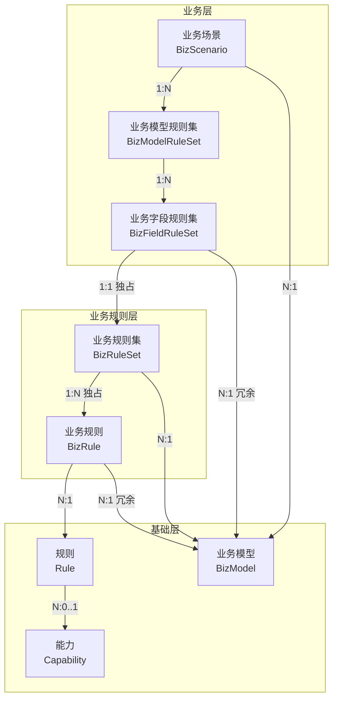

**图例说明**：

| 箭头类型 | 含义 | 示例 |
|----------|------|------|
| `-->` 实线箭头 | 关联关系（引用/包含） | BR 引用 RULE |
| `1:N` | 一对多关系 | 一个 BizRuleSet 包含多个 BizRule |
| `N:1` | 多对一关系 | 多个 BizRule 引用同一个 Rule |
| `N:1 冗余` | 多对一冗余引用（外键，创建时自动复制） | BR.bizModelId 冗余自 BRS |
| `1:1 独占` | 一对一独占关系 | BizFieldRuleSet 独占一个 BizRuleSet |
| `N:0..1` | 多对零或一关系 | Rule 可选关联 Capability |

### 2.2 层级职责

| 层级 | 职责 | 核心模型 |
|------|------|----------|
| **基础层** | 定义可复用的原子能力和规则模板 | BizModel、Capability、Rule |
| **业务规则层** | 规则的业务化实例和执行编排 | BizRuleSet、BizRule |
| **业务层** | 场景化配置体验，批量定位规则集 | BizScenario、BizModelRuleSet、BizFieldRuleSet |

### 2.3 模型关系矩阵

| 源模型 | 目标模型 | 关系类型 | 说明 |
|--------|----------|----------|------|
| Rule | Capability | N:0..1 | 能力规则关联能力（简单规则无关联） |
| BizRule | Rule | N:1 | 业务规则是规则的实例化 |
| BizRule | BizRuleSet | N:1 独占 | 一个 BizRule 只属于一个 BizRuleSet（通过 bizRuleSetId 关联） |
| BizFieldRuleSet | BizRuleSet | 1:1 独占 | 字段规则集关联业务规则集 |
| BizModelRuleSet | BizFieldRuleSet | 1:N | 模型规则集包含多个字段规则集 |
| BizScenario | BizModelRuleSet | 1:N | 场景包含多个模型规则集 |
| BizScenario | BizModel | N:1 | 多个场景可共用同一业务模型 |
| BizScenario | IdentityField | 1:0..10 内嵌 | 业务身份字段作为 BizScenario 的内嵌对象 |
| BizScenario | SubScenario | 1:N 内嵌 | 子场景作为 BizScenario 的内嵌对象 |
| BizModelRuleSet | BizModelRuleSet | N:N | 多继承，合并执行（靠前的优先级更高） |

---

## 三、基础层模型设计

### 3.1 业务模型（BizModel）

**职责**：定义业务数据结构，包含字段元信息。

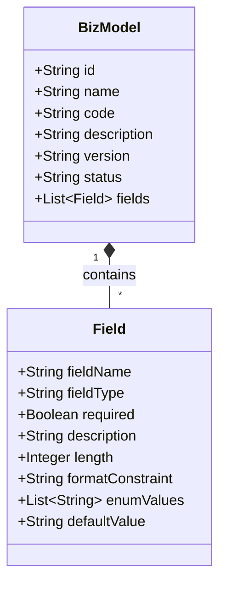

**属性说明**：

| 属性 | 类型 | 必填 | 说明 |
|------|------|------|------|
| id | String | 是 | 模型唯一标识（系统生成） |
| name | String | 是 | 模型名称 |
| code | String | 是 | 模型标识/编码（业务可读，全局唯一） |
| description | String | 否 | 模型描述 |
| version | String | 是 | 版本信息（格式：x.y.z） |
| status | String | 是 | 状态（DRAFT/ACTIVE/INACTIVE） |
| fields | List\<Field\> | 是 | 字段列表（至少包含一个字段） |

**字段属性**：

| 属性 | 类型 | 说明 |
|------|------|------|
| fieldName | String | 字段名称 |
| fieldType | String | 字段类型（String, Integer, Long, Double, Boolean, Date, Object, Array） |
| required | Boolean | 是否必填 |
| description | String | 字段描述 |
| length | Integer | 字段长度 |
| formatConstraint | String | 格式约束（正则表达式） |
| enumValues | List\<String\> | 枚举值列表 |
| defaultValue | String | 默认值 |

---

### 3.2 能力（Capability）

**职责**：定义可复用的逻辑抽象单元。

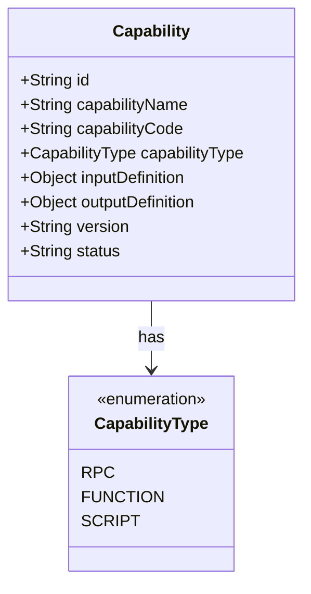

**属性说明**：

| 属性 | 类型 | 必填 | 说明 |
|------|------|------|------|
| id | String | 是 | 能力唯一标识（系统生成） |
| capabilityName | String | 是 | 能力名称（全局唯一） |
| capabilityCode | String | 是 | 能力标识/编码（全局唯一） |
| capabilityType | CapabilityType | 是 | 能力类型（RPC/函数/脚本） |
| inputDefinition | Object | 是 | 入参定义（详见 Schema 定义章节） |
| outputDefinition | Object | 是 | 出参定义（详见 Schema 定义章节） |
| version | String | 是 | 版本（格式：x.y.z，用于兼容性管理） |
| status | String | 是 | 状态（DRAFT/ACTIVE/INACTIVE） |

---

### 3.3 规则（Rule）【新增】

**职责**：定义中性的规则模板，是 BizRule 的复用基础。

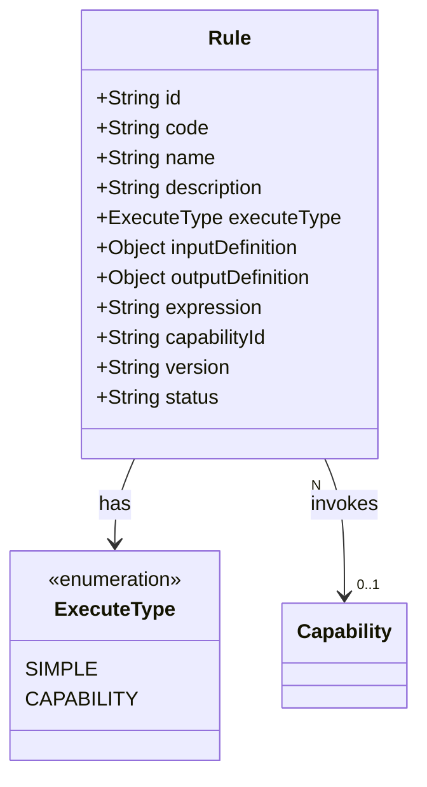

**属性说明**：

| 属性 | 类型 | 必填 | 说明 |
|------|------|------|------|
| id | String | 是 | 规则唯一标识（系统生成） |
| code | String | 是 | 规则标识（业务可读，全局唯一） |
| name | String | 是 | 规则名称 |
| description | String | 否 | 规则描述 |
| executeType | ExecuteType | 是 | 执行类别（SIMPLE/CAPABILITY） |
| inputDefinition | Object | 是 | 规则入参定义（详见 Schema 定义章节） |
| outputDefinition | Object | 是 | 规则出参定义（详见 Schema 定义章节） |
| expression | String | 条件 | QL 表达式（SIMPLE 类型必填，与 capabilityId 互斥） |
| capabilityId | String | 条件 | 关联能力 ID（CAPABILITY 类型必填，与 expression 互斥） |
| version | String | 是 | 版本（格式：x.y.z） |
| status | String | 是 | 状态（DRAFT/ACTIVE/INACTIVE） |

**执行类别说明**：

| 执行类别 | 说明 | 关键属性 |
|----------|------|----------|
| SIMPLE | 简单规则，使用 QL 表达式执行 | expression 必填，capabilityId 为空 |
| CAPABILITY | 能力规则，调用能力执行 | capabilityId 必填，expression 为空 |

**设计说明**：
- expression 和 capabilityId **互斥**，不可同时存在
- Rule 是中性模板，不包含业务场景特定信息
- Rule 可被多个 BizRule 引用（1:N 关系）

---

## 四、业务规则层模型设计

### 4.1 业务规则（BizRule）【重构】

**职责**：Rule 在特定业务场景下的实例化，定义参数映射和执行条件。

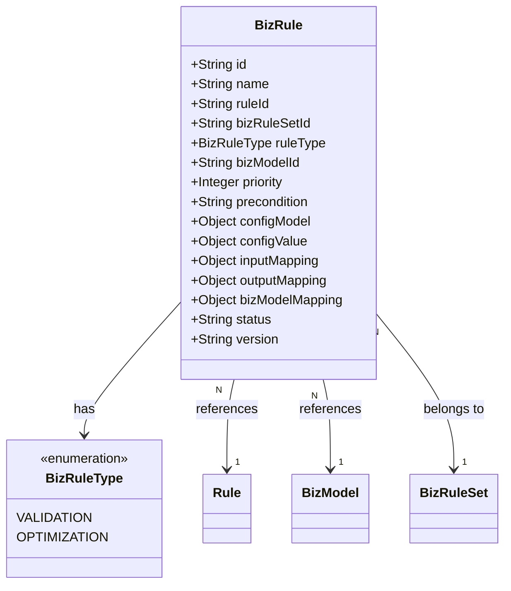

**属性说明**：

| 属性 | 类型 | 必填 | 说明 |
|------|------|------|------|
| id | String | 是 | 业务规则ID（系统生成） |
| name | String | 是 | 业务规则名称 |
| ruleId | String | 是 | 关联的 Rule ID |
| bizRuleSetId | String | 是 | 所属的 BizRuleSet ID（独占关系） |
| ruleType | BizRuleType | 是 | 规则类型（VALIDATION/OPTIMIZATION） |
| bizModelId | String | 自动 | 关联的业务模型 ID（**冗余字段，创建时自动从 BizRuleSet.bizModelId 复制，系统保证一致性，不可手动修改**） |
| priority | Integer | 否 | 执行优先级（数值越小优先级越高，默认为 0） |
| precondition | String | 否 | 执行前置条件（QL 表达式） |
| configModel | Object | 否 | 配置模型定义（详见 Schema 定义章节） |
| configValue | Object | 否 | 配置模型的值 |
| inputMapping | Object | 是 | （业务模型 + 配置模型）→ Rule 入参 |
| outputMapping | Object | 否 | （业务模型 + configModel + ruleOutput）→ 出参 |
| bizModelMapping | Object | 否 | （配置模型 + input + ruleOutput）→ bizModel |
| status | String | 是 | 状态（DRAFT/ACTIVE/INACTIVE） |
| version | String | 是 | 版本（格式：x.y.z） |

**属性职责说明**：

| 属性 | 职责 |
|------|------|
| precondition | 决定是否执行该规则的条件表达式 |
| configModel + configValue | 定义和存储静态配置 |
| inputMapping | 业务模型字段 + 配置 → Rule 需要的入参 |
| outputMapping | 组装返回给上游的出参格式 |
| bizModelMapping | 将规则执行结果回写到业务模型 |

---

### 4.2 业务规则集（BizRuleSet）【新增】

**职责**：BizRule 的集合，定义执行策略和出参聚合策略。

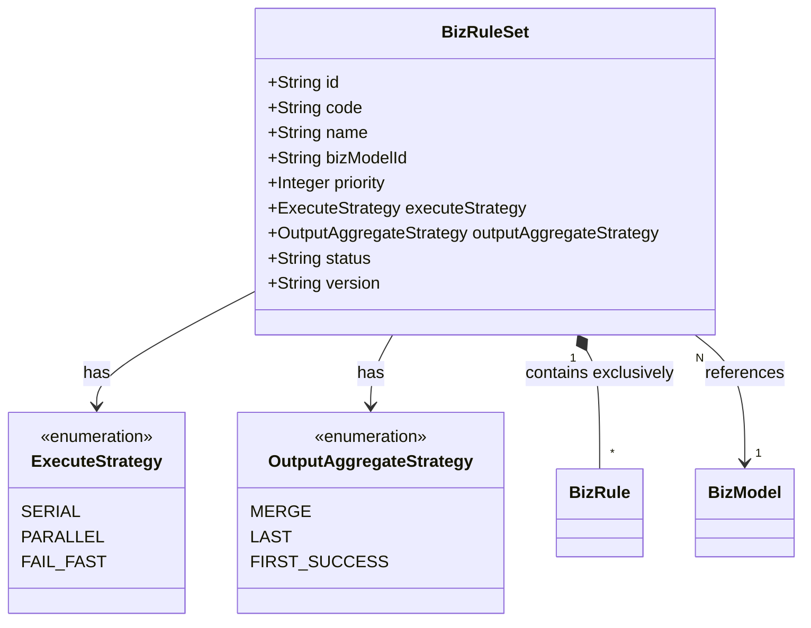

**属性说明**：

| 属性 | 类型 | 必填 | 说明 |
|------|------|------|------|
| id | String | 是 | 规则集ID（系统生成） |
| code | String | 是 | 规则集标识（全局唯一） |
| name | String | 是 | 规则集名称 |
| bizModelId | String | 是 | 关联业务模型（约束） |
| priority | Integer | 否 | 执行优先级（**预留字段，用于 BizFieldRuleSet 间排序**，数值越小优先级越高。**注：BizRule 执行顺序由 BizRule.priority 决定，非此字段**） |
| executeStrategy | ExecuteStrategy | 是 | 执行策略 |
| outputAggregateStrategy | OutputAggregateStrategy | 是 | 出参聚合策略 |
| status | String | 是 | 状态（DRAFT/ACTIVE/INACTIVE） |
| version | String | 是 | 版本（格式：x.y.z） |

**BizRule 执行顺序说明**：
- BizRule 通过 `bizRuleSetId` 关联到 BizRuleSet（反向引用）
- 执行顺序由 BizRule 自身的 `priority` 属性决定（需在 BizRule 中添加）
- SERIAL/FAIL_FAST 策略下按 priority 升序执行
- PARALLEL 策略下忽略 priority，并行执行所有规则

**执行策略说明**：

| 策略 | 说明 |
|------|------|
| SERIAL | 串行执行，按顺序 |
| PARALLEL | 并行执行 |
| FAIL_FAST | 串行执行，遇错即停 |

**出参聚合策略说明**：

| 策略 | 说明 |
|------|------|
| MERGE | 合并所有规则出参 |
| LAST | 仅取最后一个规则出参 |
| FIRST_SUCCESS | 取第一个成功的出参 |

**设计说明**：

- BizRuleSet 与 BizRule 是 **1:N 独占关系**（通过 BizRule.bizRuleSetId 反向关联）
- BizRuleSet 可独立使用，不必关联 BizFieldRuleSet
- 执行入口唯一：通过 BizRuleSet 执行
- BizRule 的执行顺序由其 priority 属性决定（SERIAL/FAIL_FAST 策略下有效）

---

## 五、业务层模型设计

### 5.1 业务场景（BizScenario）

**职责**：定义业务场景，关联业务模型，配置业务身份和子场景。

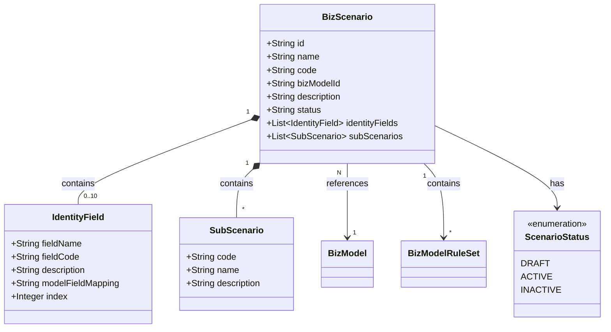

**属性说明**：

| 属性 | 类型 | 必填 | 说明 |
|------|------|------|------|
| id | String | 是 | 场景唯一标识（系统生成） |
| name | String | 是 | 场景名称 |
| code | String | 是 | 场景标识/编码（全局唯一） |
| bizModelId | String | 是 | 关联的业务模型 ID |
| description | String | 否 | 场景描述 |
| status | String | 是 | 状态（DRAFT/ACTIVE/INACTIVE） |
| identityFields | List\<IdentityField\> | 否 | 业务身份字段（最多10个） |
| subScenarios | List\<SubScenario\> | 否 | 业务子场景列表（可为空） |

**业务身份字段（IdentityField）属性**：

| 属性 | 类型 | 说明 |
|------|------|------|
| fieldName | String | 字段名称 |
| fieldCode | String | 字段code |
| description | String | 字段描述 |
| modelFieldMapping | String | 业务模型字段映射 |
| index | Integer | 预留字段索引（1-10，不可修改） |

**业务子场景（SubScenario）属性**：

| 属性 | 类型 | 说明 |
|------|------|------|
| code | String | 子场景Code |
| name | String | 子场景名称 |
| description | String | 子场景描述 |

---

### 5.2 业务模型规则集（BizModelRuleSet）

**职责**：组织和管理业务字段规则集，支持继承。

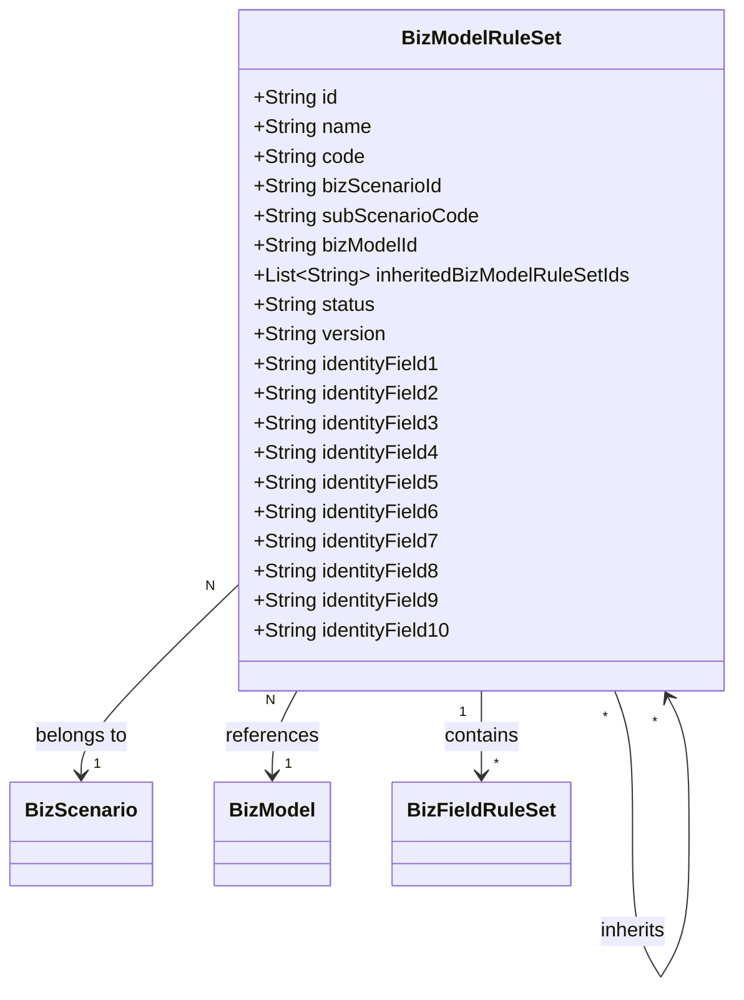

**属性说明**：

| 属性 | 类型 | 必填 | 说明 |
|------|------|------|------|
| id | String | 是 | 规则集ID（系统生成） |
| name | String | 是 | 规则集名称 |
| code | String | 是 | 规则集标识/编码（全局唯一） |
| bizScenarioId | String | 是 | 关联的业务场景 ID |
| subScenarioCode | String | 否 | 关联的子场景Code |
| bizModelId | String | 是 | 关联的业务模型（冗余设计，用于性能优化，避免关联查询） |
| inheritedBizModelRuleSetIds | List\<String\> | 否 | 继承的业务模型规则集列表（最大深度 5 层） |
| status | String | 是 | 状态（DRAFT/ACTIVE/INACTIVE） |
| version | String | 是 | 版本（格式：x.y.z） |
| identityField1~10 | String | 否 | 业务身份预留字段（10个，支持通配符 `*`） |

**业务身份预留字段说明**：
- 业务模型规则集是通用表，通过 10 个预留字段支持动态业务身份字段
- 预留字段根据业务场景的 identityFields 定义进行填充
- 预留字段支持通配符匹配（如：`*`）
- 通过业务身份字段的 index 值确定映射关系

**继承说明**：

- 支持多继承（N:N关系）
- 继承模式为合并执行，所有继承的规则集的规则都生效
- 执行顺序：子规则集优先于父规则集
- **同级多继承优先级**：按 `inheritedBizModelRuleSetIds` 列表顺序，**靠前的优先级更高**
- **最大继承深度**：5 层（超过时创建校验失败）

**继承执行语义**：

| 场景 | 行为 | 示例 |
|------|------|------|
| 规则冲突 | 子规则集优先，同 businessField 的规则覆盖父规则集 | 子集有 `priceValidation`，父集也有 → 用子集的 |
| 同级冲突 | 继承列表中靠前的规则集优先 | inheritedIds=[A,B]，A 和 B 都有 `priceValidation` → 用 A 的 |
| 执行策略 | 各 BizRuleSet 独立执行策略 | 父集 SERIAL，子集 PARALLEL → 各自按自己的策略执行 |
| 循环继承 | 创建时校验，拒绝循环继承 | A→B→C→A 禁止 |
| 状态过滤 | 仅 ACTIVE 状态的父规则集参与继承执行 | 父集为 INACTIVE → 跳过 |
| 业务身份不兼容 | 创建时校验失败，拒绝继承配置 | 父 region=B，子 region=A → 禁止继承 |
| 执行时身份不匹配 | 跳过该父规则集，继续执行其他 | 请求 region=A，父 region=B → 跳过父规则集 |

**继承执行流程**：

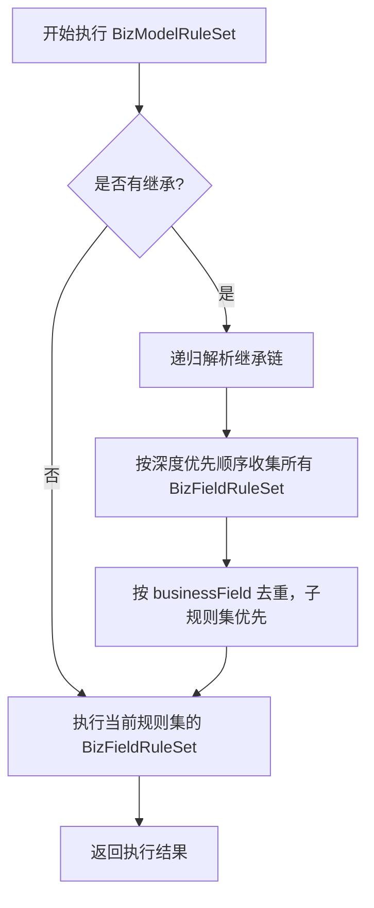

**性能考量**：

| 考量点 | 说明 | 建议 |
|--------|------|------|
| 继承链解析 | 深度越深，递归解析层次越多 | 运行时缓存继承链解析结果 |
| 缓存失效 | 继承关系变更时需清理缓存 | 父/子规则集变更时触发缓存刷新 |
| 规则数量 | 多继承会累积大量规则 | 建议单个继承链的总规则数不超过 100 条 |
| 并发执行 | PARALLEL 策略下的资源竞争 | 合理设置线程池大小 |

---

### 5.3 业务字段规则集（BizFieldRuleSet）【调整】

**职责**：定义具体的业务字段规则逻辑，关联业务规则集。

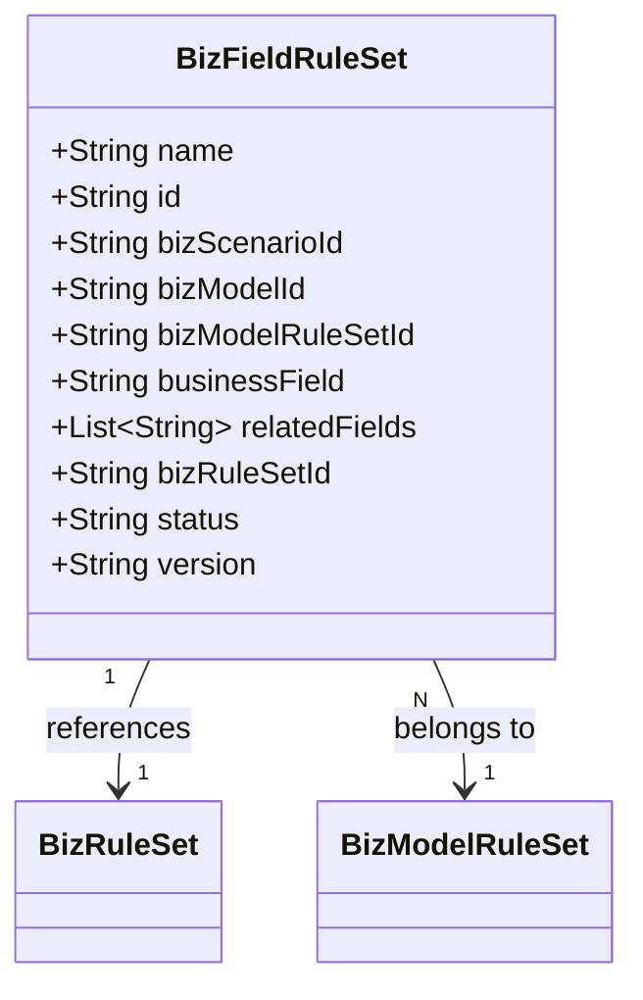

**属性说明**：

| 属性 | 类型 | 必填 | 说明 |
|------|------|------|------|
| id | String | 是 | 规则ID（系统生成） |
| name | String | 是 | 规则名称/标识 |
| bizScenarioId | String | 自动 | 业务场景（**冗余字段，创建时自动从 BizModelRuleSet 复制**） |
| bizModelId | String | 自动 | 业务模型（**冗余字段，创建时自动从 BizModelRuleSet 复制**） |
| **bizModelRuleSetId** | String | 是 | **关联的业务模型规则集（新增）** |
| businessField | String | 是 | 业务字段（业务模型字段） |
| relatedFields | List\<String\> | 否 | 关联字段集（**用于 UI 展示和 inputMapping 校验，表示该规则除 businessField 外还依赖哪些字段**） |
| **bizRuleSetId** | String | 是 | **关联的业务规则集（新增）** |
| status | String | 是 | 状态（DRAFT/ACTIVE/INACTIVE） |
| version | String | 是 | 版本（格式：x.y.z） |

**v3.0 变更**：
- ❌ 移除：`bizRuleIds`（原 BizRule 列表）
- ❌ 移除：`logic`（QL 表达式）
- ✅ 新增：`bizModelRuleSetId`（关联 BizModelRuleSet）
- ✅ 新增：`bizRuleSetId`（关联 BizRuleSet）

---

## 六、业务模型规则集匹配优先级规则

### 6.1 基础原则

1. **精确匹配优先于通配符匹配**
2. **业务身份字段的优先级由其在 identityFields 列表中的位置决定**
3. **位置越靠后（索引越大），优先级越高**

**匹配执行语义**：匹配到多个 BizModelRuleSet 时，**所有匹配的规则集都会执行**，按优先级从高到低依次执行。优先级排序规则见 §6.3。

### 6.2 匹配流程

1. 根据 **业务场景Code + 子场景Code** 筛选候选规则集
2. 根据业务身份字段值进一步匹配和排序

### 6.3 优先级比较算法（字典序）

1. 从优先级最高的字段（列表最后一个）开始逐字段比较
2. 每个字段的比较规则：**精确匹配 > 通配符匹配**
3. 如果当前字段匹配类型相同，则比较下一个优先级字段
4. 直到找到第一个不同的字段，精确匹配的规则集优先
5. 如果所有字段匹配类型完全相同，则按规则集创建时间排序（最新优先）

### 6.4 完整示例

假设 `identityFields = [region, category, brand]`（优先级：brand > category > region）

**查询条件**：`region=A, category=B, brand=C`

**候选规则集**：
- RuleSet-1: `region=A, category=B, brand=C`  (3个精确)
- RuleSet-2: `region=A, category=B, brand=*`  (2个精确)
- RuleSet-3: `region=A, category=*, brand=C`  (2个精确)
- RuleSet-4: `region=*, category=B, brand=C`  (2个精确)

**比较过程**：

**Step 1: 比较 brand（优先级最高）**
- RuleSet-1: C (精确)
- RuleSet-2: * (通配)
- RuleSet-3: C (精确)
- RuleSet-4: C (精确)

→ 结果：RuleSet-1, 3, 4 优先于 RuleSet-2

**Step 2: 比较 category（次优先级）**
- RuleSet-1: B (精确)
- RuleSet-3: * (通配)
- RuleSet-4: B (精确)

→ 结果：RuleSet-1, 4 优先于 RuleSet-3

**Step 3: 比较 region（最低优先级）**
- RuleSet-1: A (精确)
- RuleSet-4: * (通配)

→ 结果：RuleSet-1 优先于 RuleSet-4

**最终排序**：`RuleSet-1 > RuleSet-4 > RuleSet-3 > RuleSet-2`

**执行说明**：上述 4 个规则集将按排序顺序**依次全部执行**，而非仅执行最高优先级的规则集。

---

## 七、模型约束设计

### 7.1 基础层约束

#### BizModel 约束
- id 唯一性（系统生成）
- code 全局唯一性
- status 必须为有效值（DRAFT/ACTIVE/INACTIVE）
- fields 列表不能为空，至少包含一个字段

#### Rule 约束
- id 唯一性（系统生成）
- code 全局唯一性
- executeType 必须为有效值（SIMPLE/CAPABILITY）
- **expression 和 capabilityId 互斥**：
  - SIMPLE 类型：expression 必填，capabilityId 为空
  - CAPABILITY 类型：capabilityId 必填，expression 为空
- **capabilityId 引用完整性**：capabilityId 引用的 Capability 必须存在
- **capabilityId 状态约束**：CAPABILITY 类型的 Rule，其关联的 Capability 必须为 ACTIVE 状态
- inputDefinition 和 outputDefinition 不能为空
- status 必须为有效值（DRAFT/ACTIVE/INACTIVE）

#### Capability 约束
- id 唯一性（系统生成）
- capabilityName 全局唯一性
- capabilityCode 全局唯一性
- capabilityType 必须为有效值（RPC/FUNCTION/SCRIPT）
- inputDefinition 和 outputDefinition 不能为空
- status 必须为有效值（DRAFT/ACTIVE/INACTIVE）

### 7.2 业务规则层约束

#### BizRule 约束
- id 唯一性（系统生成）
- 必须关联有效的 Rule（ruleId）
- 必须关联有效的业务模型（bizModelId）
- 必须关联有效的业务规则集（bizRuleSetId）
- ruleType 必须为有效值（VALIDATION/OPTIMIZATION）
- priority 默认为 0，数值越小优先级越高
- inputMapping 中引用的字段必须在业务模型中存在
- status 必须为有效值（DRAFT/ACTIVE/INACTIVE）
- **执行类型继承**：BizRule 的执行类型由关联的 Rule.executeType 决定

#### BizRuleSet 约束
- id 唯一性（系统生成）
- code 全局唯一性
- **BizRule.bizModelId 必须与其关联的 BizRuleSet.bizModelId 一致**（创建时系统自动填充并校验）
- **BizRule.name 规则集内唯一约束**：同一 BizRuleSet 内的 BizRule 名称不可重复
- BizRuleSet 与 BizRule 是 **1:N 独占关系**（通过 BizRule.bizRuleSetId 反向关联）
- BizRule 的执行顺序由其 priority 属性决定（SERIAL/FAIL_FAST 策略下有效）
- executeStrategy 必须为有效值（SERIAL/PARALLEL/FAIL_FAST）
- outputAggregateStrategy 必须为有效值（MERGE/LAST/FIRST_SUCCESS）
- status 必须为有效值（DRAFT/ACTIVE/INACTIVE）
- **空规则集执行行为**：当 BizRuleSet 下无 ACTIVE 状态的 BizRule 时，返回空结果（不报错）

### 7.3 业务层约束

#### BizScenario 约束
- id 唯一性（系统生成）
- code 全局唯一性
- 必须关联有效的业务模型（bizModelId）
- identityFields 最多 10 个
- identityFields 中的 index 值必须在 1-10 范围内且唯一
- status 必须为有效值（DRAFT/ACTIVE/INACTIVE）

#### BizModelRuleSet 约束
- id 唯一性（系统生成）
- code 全局唯一性
- 必须关联有效的业务场景（bizScenarioId）
- 必须关联有效的业务模型（bizModelId）
- **唯一约束**：identityField1~10 + bizScenarioId + subScenarioCode 组合唯一（**注：subScenarioCode 为空时使用空字符串 `""` 参与唯一约束，避免 NULL 值导致的数据库行为差异**）
- 继承的业务模型规则集必须存在且状态为 ACTIVE
- **继承约束**：父子规则集必须具有相同的 bizScenarioId
- **继承深度约束**：最大继承深度为 5 层
- 不能循环继承
- **继承业务身份兼容性约束**：
  - **创建时校验**：父规则集的每个业务身份字段值必须能"覆盖"子规则集的对应值（父为通配符 `*` 可覆盖任意值；父为精确值时必须与子一致）
  - **执行时过滤**：用请求中的业务身份值重新校验每个父规则集是否匹配，不匹配的父规则集跳过执行
- status 必须为有效值（DRAFT/ACTIVE/INACTIVE）
- 仅 ACTIVE 状态的规则集参与执行

#### BizFieldRuleSet 约束
- id 唯一性（系统生成）
- **bizRuleSetId 全局唯一约束**：一个 BizRuleSet 只能被一个 BizFieldRuleSet 关联（通过数据库唯一索引实现 1:1 独占关系）
- **BizFieldRuleSet、BizRuleSet、BizRule 三者的 bizModelId 必须一致**
- BizFieldRuleSet 与 BizRuleSet 是 **1:1 独占关系**
- businessField 必须是业务模型中定义的字段
- relatedFields 中的字段必须是业务模型中定义的字段
- **同一 BizModelRuleSet 内，businessField 不能重复**
- status 必须为有效值（DRAFT/ACTIVE/INACTIVE）

### 7.4 跨层约束

| 约束 | 说明 | 验证时机 |
|------|------|----------|
| bizModelId 一致性 | BizFieldRuleSet、BizRuleSet、BizRule 三者必须关联同一 BizModel | 创建/更新时 |
| 独占关系 | BizRule 只属于一个 BizRuleSet，BizRuleSet 只被一个 BizFieldRuleSet 关联 | 创建/更新时 |
| 引用完整性 | 所有外键引用的目标记录必须存在 | 创建/更新时 |

### 7.5 状态转换规则

所有模型的状态字段遵循统一的状态机规则：

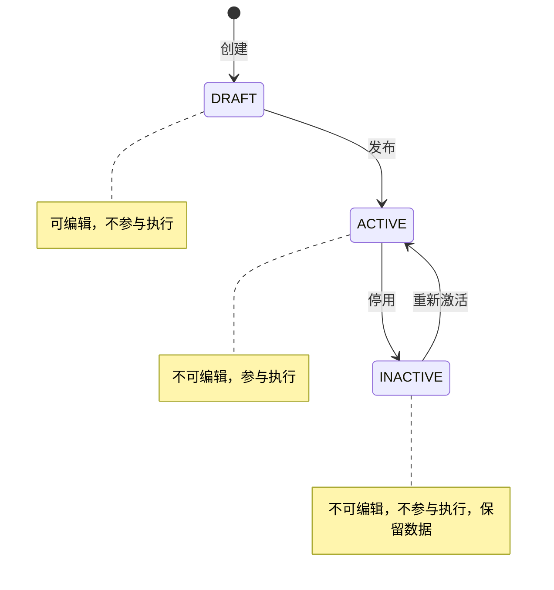

**状态转换规则**：

| 当前状态 | 目标状态 | 条件 |
|----------|----------|------|
| DRAFT | ACTIVE | 所有必填字段已填写，引用的关联对象状态为 ACTIVE |
| ACTIVE | INACTIVE | 无条件（但会影响依赖此对象的执行） |
| INACTIVE | ACTIVE | 引用的关联对象状态为 ACTIVE |

**重要说明**：系统采用**状态管理**而非物理删除，所有数据通过状态字段进行生命周期管理，不支持物理删除操作。

### 7.6 状态变更级联规则

| 源模型 | 操作 | 目标模型 | 级联行为 |
|--------|------|----------|----------|
| BizModel | 停用 | BizScenario, BizRule, BizRuleSet, BizFieldRuleSet, BizModelRuleSet | **WARNING** - 警告用户可能影响的规则执行 |
| Capability | 停用 | Rule | **WARNING** - 警告用户关联的 Rule 将无法正常执行 |
| Rule | 停用 | BizRule | **WARNING** - 警告用户关联的 BizRule 将无法正常执行 |
| BizRuleSet | 停用 | BizRule, BizFieldRuleSet | **WARNING** - 警告用户关联对象将受影响 |
| BizModelRuleSet | 停用 | BizFieldRuleSet, 子 BizModelRuleSet | **CASCADE_INACTIVE** - 级联停用所属的 BizFieldRuleSet |
| BizScenario | 停用 | BizModelRuleSet | **CASCADE_INACTIVE** - 级联停用所属的 BizModelRuleSet |

**级联行为说明**：

| 行为 | 说明 |
|------|------|
| WARNING | 仅警告用户，不自动变更关联对象状态 |
| CASCADE_INACTIVE | 自动将关联对象状态变更为 INACTIVE |

---

## 八、Schema 定义

本章节定义文档中 Object 类型字段的具体结构。

### 8.1 字段定义 Schema（FieldDefinition）

用于 `inputDefinition`、`outputDefinition` 等字段定义场景。

```json
{
  "type": "object",
  "properties": {
    "fields": {
      "type": "array",
      "items": {
        "type": "object",
        "properties": {
          "name": { "type": "string", "description": "字段名称" },
          "type": {
            "type": "string",
            "enum": ["String", "Integer", "Long", "Double", "Boolean", "Date", "Object", "Array"],
            "description": "字段类型"
          },
          "required": { "type": "boolean", "description": "是否必填" },
          "defaultValue": { "type": "string", "description": "默认值" },
          "description": { "type": "string", "description": "字段描述" }
        },
        "required": ["name", "type"]
      }
    }
  }
}
```

**示例**：

```json
{
  "fields": [
    { "name": "itemId", "type": "Long", "required": true, "description": "商品ID" },
    { "name": "price", "type": "Double", "required": true, "description": "价格" },
    { "name": "category", "type": "String", "required": false, "description": "类目" }
  ]
}
```

### 8.2 配置模型 Schema（ConfigModel）

用于 `BizRule.configModel` 字段，定义规则的静态配置结构。

```json
{
  "type": "object",
  "properties": {
    "fields": {
      "type": "array",
      "items": {
        "type": "object",
        "properties": {
          "name": { "type": "string", "description": "配置项名称" },
          "type": {
            "type": "string",
            "enum": ["String", "Integer", "Long", "Double", "Boolean", "Array"],
            "description": "配置项类型"
          },
          "required": { "type": "boolean", "description": "是否必填" },
          "defaultValue": { "type": "any", "description": "默认值" },
          "description": { "type": "string", "description": "配置项描述" },
          "options": {
            "type": "array",
            "items": { "type": "string" },
            "description": "可选值列表（枚举场景）"
          }
        },
        "required": ["name", "type"]
      }
    }
  }
}
```

### 8.3 映射规则 Schema（MappingRule）

用于 `inputMapping`、`outputMapping`、`bizModelMapping` 字段。

```json
{
  "type": "object",
  "properties": {
    "mappings": {
      "type": "array",
      "items": {
        "type": "object",
        "properties": {
          "source": {
            "type": "string",
            "description": "源字段路径，支持点号表达式，如 bizModel.price、config.threshold"
          },
          "target": {
            "type": "string",
            "description": "目标字段路径"
          },
          "transform": {
            "type": "string",
            "description": "可选的转换表达式（QL 语法）"
          },
          "defaultValue": {
            "type": "any",
            "description": "源字段为空时的默认值"
          }
        },
        "required": ["source", "target"]
      }
    }
  }
}
```

**字段路径前缀说明**：

| 前缀 | 说明 | 可用于 | 示例 |
|------|------|--------|------|
| `bizModel.` | 业务模型字段 | inputMapping, outputMapping, bizModelMapping | `bizModel.price` |
| `config.` | 配置模型字段 | inputMapping, outputMapping, bizModelMapping | `config.threshold` |
| `input.` | 规则入参字段 | outputMapping, bizModelMapping | `input.originalPrice` |
| `ruleInput.` | 规则入参字段（inputMapping 的目标） | inputMapping（仅作为 target） | `ruleInput.price` |
| `ruleOutput.` | 规则执行结果字段 | outputMapping, bizModelMapping | `ruleOutput.isValid` |
| `output.` | 最终输出字段（outputMapping 的目标） | outputMapping（仅作为 target） | `output.result` |

**映射示例**：

```json
{
  "mappings": [
    { "source": "bizModel.price", "target": "input.originalPrice" },
    { "source": "config.discountRate", "target": "input.rate" },
    { "source": "ruleOutput.finalPrice", "target": "bizModel.salePrice" },
    {
      "source": "bizModel.quantity",
      "target": "input.qty",
      "transform": "value > 0 ? value : 1",
      "defaultValue": 1
    }
  ]
}
```

### 8.4 配置值 Schema（ConfigValue）

用于 `BizRule.configValue` 字段，存储配置模型的实际值。

```json
{
  "type": "object",
  "description": "键值对形式，key 对应 configModel 中定义的字段名",
  "additionalProperties": true
}
```

**示例**：

```json
{
  "threshold": 100,
  "enableDiscount": true,
  "allowedCategories": ["服装", "数码", "家居"]
}
```

---

## 九、执行流程

### 9.1 执行入口

**技术执行入口唯一**：所有规则执行最终都通过 BizRuleSet（业务规则集）执行。

**两种业务调用路径**：

| 方式 | 路径 | 场景 |
|------|------|------|
| 字段校验场景 | BizScenario → BizModelRuleSet → BizFieldRuleSet → BizRuleSet | 通过业务层批量定位规则集 |
| 独立执行场景 | 直接调用 BizRuleSet | 不走字段校验流程，适用于独立规则执行 |

**说明**：两种路径最终都调用 BizRuleSet 执行，区别在于定位规则集的方式不同。路径 1 中，首先通过业务身份匹配算法（§6）定位 BizModelRuleSet，再遍历其 BizFieldRuleSet 获取 BizRuleSet。

**precondition 执行说明**：

- **执行时机**：precondition 在 inputMapping **之前**执行
- **可用变量范围**：仅可使用原始业务模型数据（`bizModel.*`）和配置值（`config.*`）
- **不可用变量**：inputMapping 转换后的变量（因尚未执行）
- **表达式示例**：`bizModel.amount > 0 && config.enabled == true`

**Rule 缓存机制**：执行引擎通过 `ruleId` 获取 Rule 定义时，采用缓存机制：首次查询后缓存 Rule 信息（包括 executeType、expression、capabilityId 等），后续执行直接从缓存读取。缓存在 Rule 状态变更时失效。

### 9.2 执行流程图

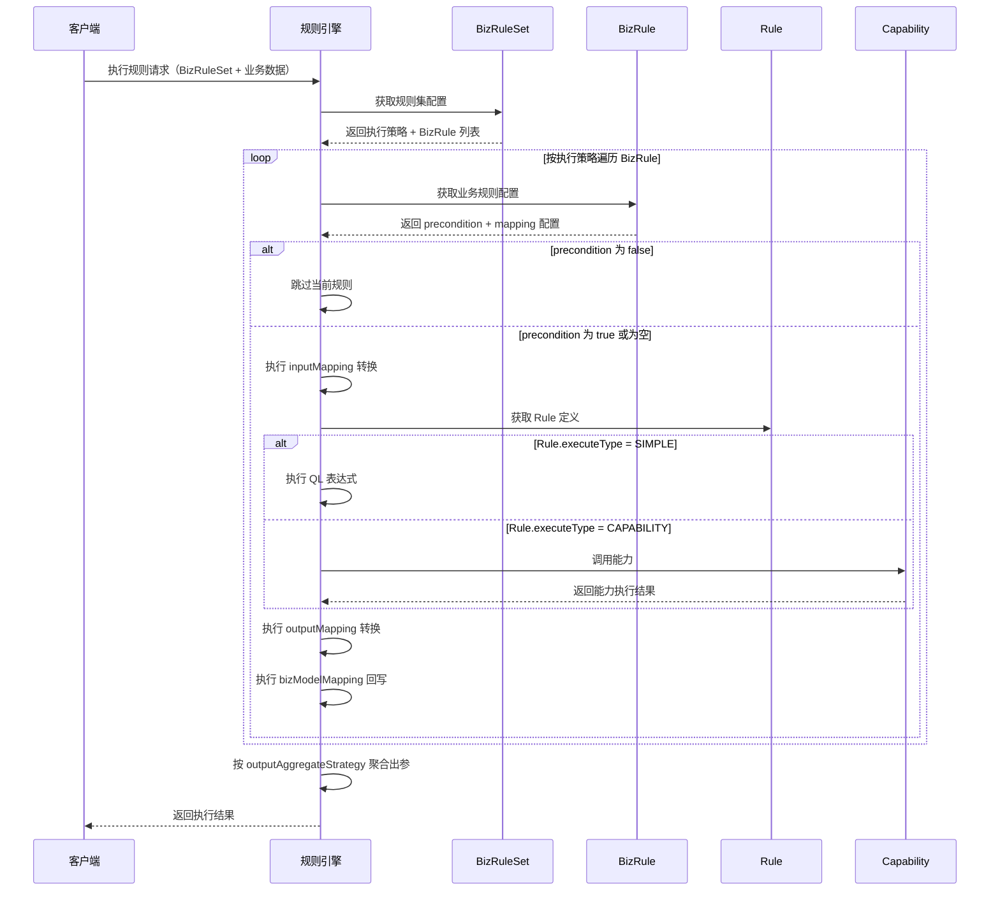

---

## 十、业务配置流程

### 10.1 角色分工

| 角色 | 职责 | 操作范围 |
|------|------|----------|
| **开发人员** | 基础准备 | 业务模型、规则模板、业务场景（含业务身份定义） |
| **业务运营** | 规则配置 | 业务模型规则集、业务字段规则集、业务规则 |

### 10.2 完整配置流程

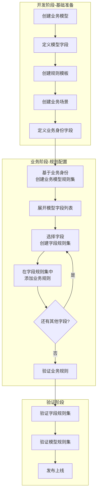

### 10.3 开发阶段：基础准备

#### 10.3.1 创建业务模型

| 步骤 | 操作 | 产出 |
|------|------|------|
| 1 | 创建业务模型：名称、code | BizModel |
| 2 | 定义字段：字段名、类型、是否必填等 | Field[] |

**示例**：
```yaml
模型名称: 订单模型
模型编码: ORDER
状态: DRAFT
字段列表:
  - orderId: Long (必填)
  - amount: Double (必填)
  - status: String (必填)
  - region: String (必填)
  - channel: String (必填)
```

#### 10.3.2 创建规则模板

| 步骤 | 操作 | 产出 |
|------|------|------|
| 1 | 创建规则：名称、code、执行类型 | Rule |
| 2 | 配置入参/出参定义 | inputDefinition/outputDefinition |
| 3 | 配置表达式或关联能力 | expression 或 capabilityId |

**示例**：
```yaml
规则名称: 订单金额范围校验
规则编码: ORDER_AMOUNT_RANGE
执行类型: SIMPLE
入参定义:
  - amount: Double (必填)
出参定义:
  - isValid: Boolean
  - message: String
表达式: amount > 0 && amount < 1000000
```

#### 10.3.3 创建业务场景 + 定义业务身份

| 步骤 | 操作 | 产出 |
|------|------|------|
| 1 | 创建业务场景：名称、code、关联模型 | BizScenario |
| 2 | **定义业务身份字段**：从业务模型字段中选择 | IdentityField[] |

**业务身份字段配置示例**：
```yaml
业务场景: 订单创建校验
关联模型: ORDER
业务身份字段:
  - index: 1, fieldCode: region, 映射: bizModel.region      # 地区
  - index: 2, fieldCode: channel, 映射: bizModel.channel    # 渠道
  - index: 3, fieldCode: bizType, 映射: bizModel.bizType    # 业务类型
```

### 10.4 业务阶段：规则配置

#### 10.4.1 基于业务身份创建业务模型规则集

| 步骤 | 操作 | 系统反馈 |
|------|------|----------|
| 1 | 进入「业务模型规则集」页面 | 显示规则集列表 |
| 2 | 点击「新建规则集」 | 打开创建表单 |
| 3 | 选择业务场景 | 自动加载业务身份字段 |
| 4 | **填写业务身份值**（支持精确值或通配符 `*`） | - |
| 5 | 点击「保存」 | 创建成功，产出 BizModelRuleSet |

**业务模型规则集配置示例**：
```yaml
规则集名称: 华东天猫订单规则
业务场景: 订单创建校验
业务身份:
  - region: 华东       # 精确匹配
  - channel: 天猫      # 精确匹配
  - bizType: *        # 通配符，匹配所有业务类型
```

#### 10.4.2 展开字段列表，添加字段规则集

| 步骤 | 操作 | 系统反馈 |
|------|------|----------|
| 1 | 点击规则集进入详情页 | 显示**模型字段列表** |
| 2 | 字段列表展示所有可配置字段 | 每个字段显示配置状态 |
| 3 | 点击目标字段的「添加规则」 | 打开字段规则集编辑面板 |
| 4 | 创建字段规则集 | 产出 BizFieldRuleSet + BizRuleSet |

**界面示意**：
```
┌─────────────────────────────────────────────────────┐
│  业务模型规则集：华东天猫订单规则                      │
│  业务身份：region=华东, channel=天猫, bizType=*       │
├─────────────────────────────────────────────────────┤
│  字段列表                                            │
│  ┌─────────┬──────────┬─────────────┐               │
│  │ 字段名   │ 字段类型  │ 规则配置     │               │
│  ├─────────┼──────────┼─────────────┤               │
│  │ orderId │ Long     │ [未配置]     │               │
│  │ amount  │ Double   │ [编辑规则] ← │ ← 点击进入     │
│  │ status  │ String   │ [未配置]     │               │
│  └─────────┴──────────┴─────────────┘               │
└─────────────────────────────────────────────────────┘
```

#### 10.4.3 在字段规则集中添加业务规则

| 步骤 | 操作 | 系统反馈 |
|------|------|----------|
| 1 | 在字段规则集中点击「添加规则」 | 打开规则选择面板 |
| 2 | 选择规则模板 | 自动加载规则信息 |
| 3 | 配置入参映射 | - |
| 4 | 点击「保存」 | 产出 BizRule |

**字段规则集编辑界面示意**：
```
┌─────────────────────────────────────────────────────┐
│  字段规则集：amount 字段校验                          │
│  所属规则集：华东天猫订单规则                          │
├─────────────────────────────────────────────────────┤
│  已配置规则                                          │
│  ┌─────────────────┬──────────┬─────────┐           │
│  │ 规则名称         │ 规则类型  │ 操作     │           │
│  ├─────────────────┼──────────┼─────────┤           │
│  │ 订单金额范围校验  │ VALIDATION│ [编辑]   │           │
│  └─────────────────┴──────────┴─────────┘           │
│                                                      │
│  [+ 添加规则]                                        │
└─────────────────────────────────────────────────────┘
```

### 10.5 验证阶段

验证遵循**自底向上**的顺序：


| 验证层级 | 验证内容 | 测试方式 |
|----------|----------|----------|
| 业务规则 | 单条规则逻辑正确性 | 输入测试数据，验证规则输出 |
| 字段规则集 | 字段下所有规则协同执行 | 输入字段值，验证聚合结果 |
| 模型规则集 | 完整业务数据校验 | 输入完整业务对象，验证全部字段 |

### 10.6 配置层次关系

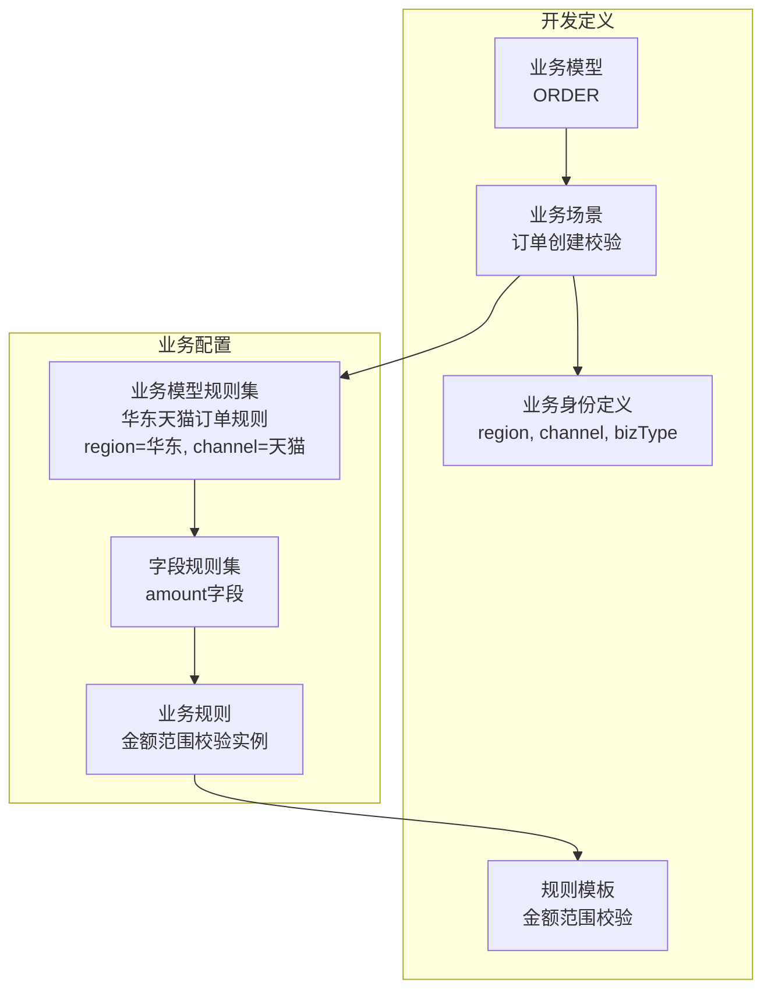

### 10.7 界面交互设计

#### 10.7.1 大型业务模型的字段展示

业务模型可能包含 100+ 字段，且存在多级嵌套和数组结构，需要特殊的界面设计。

**设计挑战**：

| 挑战 | 说明 |
|------|------|
| 字段数量大 | 100+ 字段，无法一屏展示 |
| 多级嵌套 | 对象类型字段包含子字段（如 `address.city`） |
| 数组结构 | 数组元素需要配置规则（如 `items[*].price`） |
| 快速定位 | 业务人员需要快速找到目标字段 |

**数据模型示例**：

```yaml
订单模型 (ORDER):
  - orderId: Long
  - amount: Double
  - status: String
  - address: Object                    # 嵌套对象
      - province: String
      - city: String
      - detail: String
  - items: Array<Object>               # 数组
      - itemId: Long
      - name: String
      - price: Double
      - quantity: Integer
  - payment: Object                    # 嵌套对象
      - method: String
      - amount: Double
      - status: String
```

#### 10.7.2 树形字段列表

采用**可折叠树形结构**展示字段层级：

```
┌─────────────────────────────────────────────────────────────────────────┐
│  ← 返回    华东天猫订单规则                              [测试] [发布]   │
├─────────────────────────────────────────────────────────────────────────┤
│  业务身份：region=华东, channel=天猫     状态：🟡 草稿                   │
├─────────────────────────────────────────────────────────────────────────┤
│  🔍 [搜索字段名...]           [全部展开] [全部折叠]  [只看已配置 ☐]     │
├─────────────────────────────────────────────────────────────────────────┤
│  📋 字段规则配置                                          已配置: 5/28  │
│  ┌─────────────────────────────────────────────────────────────────────┐│
│  │ ▼ 📦 ORDER (订单模型)                                              ││
│  │   ├─ orderId (Long)                              [ - ]             ││
│  │   ├─ amount (Double)                     ✅ 1条规则  [编辑]         ││
│  │   ├─ status (String)                     ✅ 1条规则  [编辑]         ││
│  │   │                                                                 ││
│  │   ├─▶ 📁 address (Object)                                          ││
│  │   │   ├─ province (String)                       [ - ]             ││
│  │   │   ├─ city (String)                           [ - ]             ││
│  │   │   └─ detail (String)               ✅ 1条规则  [编辑]           ││
│  │   │                                                                 ││
│  │   ├─▶ 📋 items[] (Array)                         ✅ 2条规则         ││
│  │   │   ├─ [*].itemId (Long)                       [ - ]             ││
│  │   │   ├─ [*].name (String)                       [ - ]             ││
│  │   │   ├─ [*].price (Double)            ✅ 1条规则  [编辑]           ││
│  │   │   └─ [*].quantity (Integer)        ✅ 1条规则  [编辑]           ││
│  │   │                                                                 ││
│  │   └─▶ 📁 payment (Object)                                          ││
│  │       ├─ method (String)                         [ - ]             ││
│  │       ├─ amount (Double)               ✅ 1条规则  [编辑]           ││
│  │       └─ status (String)                         [ - ]             ││
│  └─────────────────────────────────────────────────────────────────────┘│
└─────────────────────────────────────────────────────────────────────────┘
```

**图例说明**：

| 图标 | 含义 |
|------|------|
| 📦 | 根模型 |
| 📁 | 嵌套对象 (Object) |
| 📋 | 数组 (Array) |
| ▶/▼ | 折叠/展开 |
| ✅ | 已配置规则 |
| [ - ] | 未配置，点击添加 |

#### 10.7.3 字段路径表达式

对于嵌套和数组字段，使用**路径表达式**标识：

| 字段路径 | 说明 |
|----------|------|
| `amount` | 一级字段 |
| `address.city` | 嵌套对象字段 |
| `items[*].price` | 数组元素字段（所有元素） |
| `items[0].price` | 数组元素字段（第一个元素） |
| `payment.amount` | 嵌套对象字段 |

#### 10.7.4 搜索与筛选

**实时搜索**：输入关键词，过滤匹配的字段

```
🔍 [price                    ]   ← 输入关键词，实时过滤

搜索结果：3 个匹配字段
├─ amount (Double)                       路径: ORDER.amount
├─ items[*].price (Double)               路径: ORDER.items[*].price
└─ payment.amount (Double)               路径: ORDER.payment.amount
```

**筛选选项**：

| 筛选维度 | 选项 |
|----------|------|
| 类型筛选 | 全部 / String / Integer/Long / Double / Boolean / Object / Array |
| 状态筛选 | 全部 / 已配置规则 / 未配置规则 |
| 层级筛选 | 全部 / 一级字段 / 嵌套字段 / 数组元素 |

#### 10.7.5 数组字段规则配置

数组字段支持**数组级规则**和**元素级规则**两种：

| 规则层级 | 说明 | 表达式示例 |
|----------|------|------------|
| 数组级 | 校验整个数组 | `items.size() > 0 && items.size() <= 100` |
| 元素级 | 校验每个元素的字段 | `items[*].price > 0` |

**数组规则配置界面**：

```
┌─────────────────────────────────────────────────────────────────────────┐
│  items[] 数组规则配置                                             [×]  │
├─────────────────────────────────────────────────────────────────────────┤
│  📋 数组级规则（校验整个数组）                                          │
│  ├─ 数组非空校验           类型: VALIDATION           [编辑] [删除]     │
│  └─ 数组长度限制           类型: VALIDATION           [编辑] [删除]     │
│  [+ 添加数组级规则]                                                     │
├─────────────────────────────────────────────────────────────────────────┤
│  📦 元素级规则（校验每个元素的字段）                                    │
│  ├─ [*].price (Double)                                                  │
│  │   └─ 价格范围校验       类型: VALIDATION           [编辑] [删除]     │
│  ├─ [*].quantity (Integer)                                              │
│  │   └─ 数量正整数校验     类型: VALIDATION           [编辑] [删除]     │
└─────────────────────────────────────────────────────────────────────────┘
```

#### 10.7.6 交互优化汇总

| 场景 | 优化方案 |
|------|----------|
| 字段数量多 | 树形折叠 + 搜索 + 筛选 |
| 多级嵌套 | 树形展示 + 面包屑导航 + 路径表达式 |
| 数组字段 | 分离数组级/元素级规则 |
| 快速定位 | 实时搜索 + 只看已配置筛选 |
| 批量操作 | 多选 + 批量添加规则 |
| 状态可视化 | ✅ 已配置 / [ - ] 未配置 / 规则数量统计 |

**快捷操作**（右键菜单）：

| 操作 | 说明 |
|------|------|
| 添加规则 | 为当前字段添加规则 |
| 复制字段路径 | 复制完整路径表达式 |
| 查看字段详情 | 显示字段类型、描述等信息 |
| 展开/折叠子字段 | 展开或折叠嵌套结构 |

---

## 十一、整体架构图

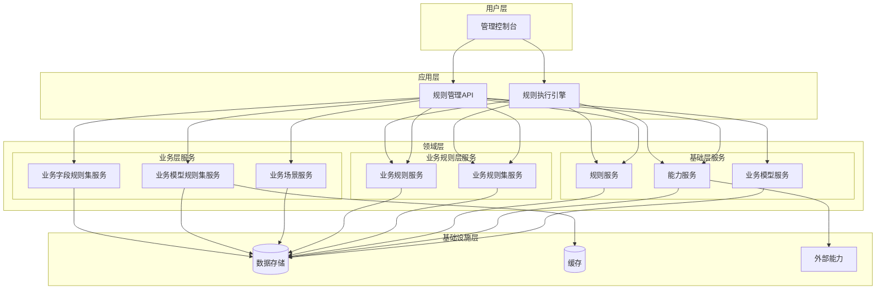

---

## 十二、待讨论事项

### 12.1 字段与业务规则集的详细设计

**现状**：用户提到"相关的字段需要与业务规则集进行设计，晚点讨论"

**待讨论内容**：

- BizFieldRuleSet.relatedFields 与 BizRuleSet 的协作机制
- 字段映射的详细设计

### 12.2 QL 表达式的语法约束

**待讨论内容**：

- Rule.expression 和 BizRule.precondition 的 QL 语法规范
- 支持的操作符和函数

### 12.3 能力执行机制的详细设计

**待讨论内容**：

- RPC/FUNCTION/SCRIPT 三种类型的具体执行机制

---

## 附录

### A. 术语表

| 术语 | 说明 |
|------|------|
| 业务模型（BizModel） | 定义业务数据结构，包含字段元信息 |
| 能力（Capability） | 可复用的逻辑抽象单元，支持 RPC/函数/脚本三种类型 |
| 规则（Rule） | 基础层的中性规则模板，定义入参、出参、执行方式 |
| 业务规则（BizRule） | Rule 在特定业务场景下的实例化，包含参数映射和执行条件 |
| 业务规则集（BizRuleSet） | BizRule 的集合，定义执行策略和聚合策略 |
| 业务场景（BizScenario） | 定义业务场景，关联业务模型，配置业务身份和子场景 |
| 业务模型规则集（BizModelRuleSet） | 组织和管理业务字段规则集，支持继承 |
| 业务字段规则集（BizFieldRuleSet） | 定义具体的业务字段规则逻辑，关联业务规则集 |
| 简单规则 | 使用 QL 表达式执行的规则（Rule.executeType = SIMPLE） |
| 能力规则 | 调用 Capability 执行的规则（Rule.executeType = CAPABILITY） |
| 执行策略 | 规则集内规则的执行方式（SERIAL/PARALLEL/FAIL_FAST） |
| 出参聚合策略 | 多个规则出参的聚合方式（MERGE/LAST/FIRST_SUCCESS） |
| 业务身份字段 | 用于规则集匹配的动态字段，最多 10 个 |
| 继承 | BizModelRuleSet 的多继承机制，支持规则复用 |