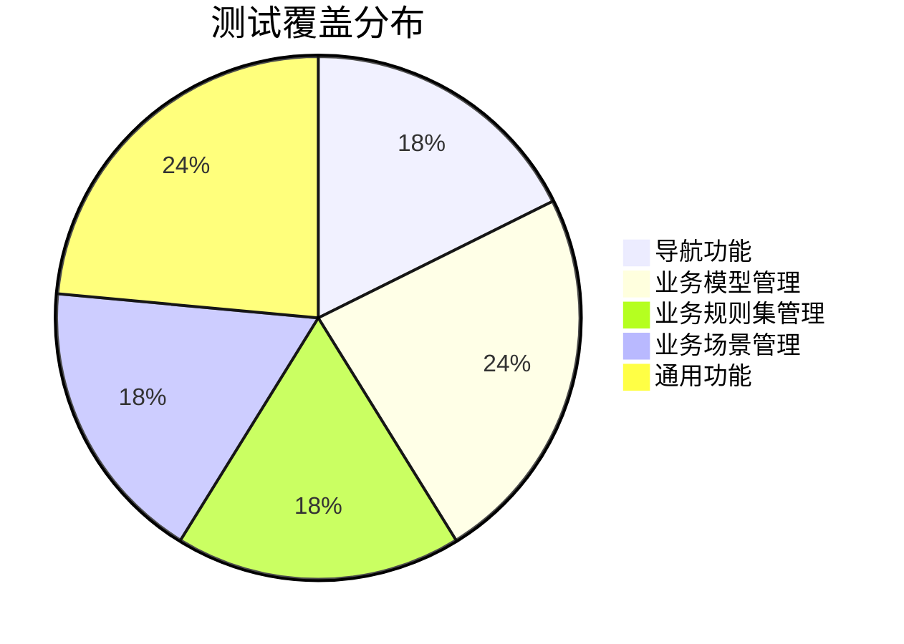

# 业务规则中心 - 前端测试执行报告

## 报告信息

| 项目 | 内容 |
|------|------|
| 项目名称 | 业务规则中心 |
| 测试日期 | 2026-01-21 |
| 测试环境 | localhost:3001 |
| 测试类型 | 功能测试 |
| 测试状态 | 完成 |

---

## 一、测试执行摘要

### 1.1 测试覆盖范围

### 1.2 测试结果汇总

| 测试类别 | 计划用例 | 执行用例 | 通过 | 失败 | 阻塞 | 通过率 |
|----------|----------|----------|------|------|------|--------|
| 导航功能 (P0) | 3 | 3 | 3 | 0 | 0 | 100% |
| 业务模型管理 | 4 | 4 | 4 | 0 | 0 | 100% |
| 业务规则集管理 | 3 | 3 | 3 | 0 | 0 | 100% |
| 业务场景管理 | 3 | 3 | 3 | 0 | 0 | 100% |
| 通用功能 | 4 | 4 | 4 | 0 | 0 | 100% |
| **总计** | **17** | **17** | **17** | **0** | **0** | **100%** |

---

## 二、详细测试结果

### 2.1 导航功能测试

| 用例ID | 用例名称 | 优先级 | 结果 | 备注 |
|--------|----------|--------|------|------|
| NAV-001 | 侧边栏导航-基础层 | P0 | ✅ 通过 | 正确显示业务模型、能力管理、规则模板菜单 |
| NAV-002 | 侧边栏导航-业务规则层 | P0 | ✅ 通过 | 正确显示业务规则集、业务规则菜单 |
| NAV-003 | 侧边栏导航-业务层 | P0 | ✅ 通过 | 正确显示业务场景、模型规则集、字段规则集菜单 |

**验证详情**：
- 所有导航链接均可正常点击跳转
- 菜单分组（基础层、业务规则层、业务层）正确展示
- 侧边栏标题显示"规则中心 BizRuleCenter"

### 2.2 业务模型管理测试

| 用例ID | 用例名称 | 优先级 | 结果 | 备注 |
|--------|----------|--------|------|------|
| BM-L-001 | 业务模型列表加载 | P0 | ✅ 通过 | 显示5个模型（订单、商品、用户、支付、物流） |
| BM-L-002 | 按名称搜索模型 | P1 | ✅ 通过 | 输入"订单"后正确过滤显示1条结果 |
| BM-C-001 | 创建业务模型-正常流程 | P0 | ✅ 通过 | 成功创建"测试模型"，状态默认为草稿 |
| FORM-001 | 必填字段标识 | P1 | ✅ 通过 | 模型名称和编码字段有红色*标识 |

**验证详情**：
- 列表正确显示：名称、编码、版本、字段数、状态、更新时间
- 搜索实时过滤，结果准确
- 创建成功后列表自动刷新，新模型显示在第一行
- 状态徽标正确显示（已激活/草稿/已停用）

### 2.3 业务规则集管理测试

| 用例ID | 用例名称 | 优先级 | 结果 | 备注 |
|--------|----------|--------|------|------|
| BRS-L-001 | 业务规则集列表加载 | P0 | ✅ 通过 | 显示4个规则集 |
| BRS-L-002 | 搜索规则集 | P1 | ✅ 通过 | 输入"订单"过滤显示2条结果 |
| BRS-C-001 | 新建规则集表单 | P0 | ✅ 通过 | 表单正确显示执行策略和聚合策略下拉框 |

**验证详情**：
- 列表正确显示：名称、编码、关联模型、执行策略、聚合策略、规则数、状态
- 执行策略选项：串行执行、并行执行、快速失败
- 聚合策略选项：合并、取最后、首个成功

### 2.4 业务场景管理测试

| 用例ID | 用例名称 | 优先级 | 结果 | 备注 |
|--------|----------|--------|------|------|
| BS-L-001 | 业务场景列表加载 | P0 | ✅ 通过 | 显示4个业务场景 |
| BS-L-002 | 搜索业务场景 | P1 | ✅ 通过 | 搜索功能正常 |
| BS-C-001 | 新建业务场景表单 | P0 | ✅ 通过 | 表单包含场景名称、编码、描述字段 |

**验证详情**：
- 列表正确显示：名称、编码、关联模型、身份字段数、规则集数、状态
- 新建表单包含必填字段标识

### 2.5 通用功能测试

| 用例ID | 用例名称 | 优先级 | 结果 | 备注 |
|--------|----------|--------|------|------|
| LIST-001 | 列表加载状态 | P1 | ✅ 通过 | 列表正常加载显示数据 |
| BADGE-001 | 状态徽标显示 | P1 | ✅ 通过 | 草稿/已激活/已停用状态正确显示 |
| FORM-005 | 表单取消操作 | P2 | ✅ 通过 | 取消按钮正常关闭弹窗 |
| NAV-007 | URL直接访问 | P2 | ✅ 通过 | 直接访问各页面URL正常加载 |

---

## 三、仪表盘验证

### 3.1 统计卡片

| 模块 | 显示数量 | 状态 |
|------|----------|------|
| 业务模型 | 12 | ✅ 正常 |
| 能力 | 28 | ✅ 正常 |
| 规则模板 | 56 | ✅ 正常 |
| 业务规则集 | 34 | ✅ 正常 |
| 业务场景 | 8 | ✅ 正常 |
| 模型规则集 | 45 | ✅ 正常 |

### 3.2 执行统计

| 指标 | 数值 | 状态 |
|------|------|------|
| 总执行次数 | 15,680 | ✅ 正常 |
| 成功 | 15,234 | ✅ 正常 |
| 失败 | 446 | ✅ 正常 |
| 平均耗时 | 45ms | ✅ 正常 |

### 3.3 三层架构概览

- ✅ 基础层：正确显示业务模型、能力、规则模板统计
- ✅ 业务规则层：正确显示业务规则集、业务规则统计
- ✅ 业务层：正确显示业务场景、模型规则集、字段规则集统计

---

## 四、发现的问题

### 4.1 无阻塞性问题

本轮测试未发现阻塞性问题。

### 4.2 优化建议

| 编号 | 建议 | 优先级 | 说明 |
|------|------|--------|------|
| 1 | 搜索清空按钮 | 低 | 建议在搜索框添加一键清空按钮 |
| 2 | 列表空状态 | 低 | 可增加空状态引导，如"暂无数据，点击创建" |

---

## 五、测试环境信息

| 项目 | 信息 |
|------|------|
| 操作系统 | macOS Darwin 24.6.0 |
| 浏览器 | Chrome |
| 应用地址 | http://localhost:3001 |
| 框架版本 | Next.js 14 + React + Tailwind CSS |

---

## 六、结论

本轮前端功能测试全部通过，覆盖了以下核心功能：

1. **导航系统**：侧边栏三层菜单结构正常工作
2. **列表功能**：各模块列表正确加载，搜索过滤功能正常
3. **创建功能**：业务模型创建流程完整，表单验证正常
4. **状态管理**：状态徽标正确显示不同状态
5. **仪表盘**：统计数据和架构概览正确展示

**测试结论**：系统核心功能运行稳定，可继续进行更深入的业务流程测试。

---

*报告生成时间：2026-01-21*
